#  문서 데이터
## 참고 사이트
- Beautiful Soup: https://www.crummy.com/software/BeautifulSoup/bs4/doc/#
- requests: http://pythonstudy.xyz/python/article/403-%ED%8C%8C%EC%9D%B4%EC%8D%AC-Web-Scraping
- urllib: https://www.acmicpc.net/blog/view/16
- Python for Data Analysis by Wes McKinney: https://github.com/wesm/pydata-book

## 데이터 수집 및 파싱(Parsing)
### 웹 페이지 읽기

`requests` 모듈을 이용하여 웹 페이지를 읽어 올 수 있다.

- 다음(daum) 홈페이지에 접속해서 HTML 문서를 가져와 화면에 출력하는 예이다.


```python
import requests

resp = requests.get( 'http://daum.net' )
 
if (resp.status_code == requests.codes.ok):
    html = resp.text
html.split('\n')[0:10]
```


    ['<!DOCTYPE html>',
     '<html lang="ko" class="">',
     '<head>',
     '<meta charset="utf-8"/>',
     '<title>Daum</title>',
     '<meta property="og:url" content="https://www.daum.net/">',
     '<meta property="og:type" content="website">',
     '<meta property="og:title" content="Daum">',
     '<meta property="og:image" content="//i1.daumcdn.net/svc/image/U03/common_icon/5587C4E4012FCD0001">',
     '<meta property="og:description" content="나의 관심 콘텐츠를 가장 즐겁게 볼 수 있는 Daum">']


### 파싱(Beautiful Soup)
BeautifulSoup 모듈을 이용해서 웹 페이지에서 필요한 정보들을 찾아낼 수 있다.

- 설치

```python
pip install beautifulsoup4 # 또는
conda install -c anaconda beautifulsoup4 # 아나콘다를 이용할 경우
```

- BeautifulSoup 웹페이지 파싱
웹 문서를 입력받아 bs객체를 만든다. bs 객체를 이용하여 필요한 정보들에 접근해서 원하는 것들을 수집할 수 있다. 원하는 성분으로 접근하는 방법은 여러 가지가 있으나 select() 함수를 이용하는 방법이 있다. select 함수의 인자는 css selector 조합 문자열을 사용한다. css selector에 대한 자세한 설명은 [W3 Schools CSS Selector Reference](https://www.w3schools.com/cssref/css_selectors.asp)를 참조한다. 다음은 몇 가지 예를 보여준다.

| Selector | 예제 | 설명 | CSS 버전 |
| ---- | ---- | ----- | ---- | ----- |
|`.class` | `.intro` | `class="intro"`인 모든 성분 선택 | 1 |
|`#id` | `#firstname` | `id="firstname"`인 모든 성분 선택 | 1 |
| `*` | `*` | 모든 성분 선택 | 2 |
|`element` | `p` | `<p>` 성분 모두 선택 | 1 |
|`element, element` | `div, p` | `<div>` 또는 `<p>`를 갖는 모든 성분 선택 | 1 |
|`element element` | `div p` | `<div>` 성분 안에 `<p>` 성분을 갖는 모든 성분 선택| 1 |
|`element>element` | `div > p` | 부모가 `<div>`인 모든 `<p>` 성분 선택 | 2 |
|`element+element` | `div + p` | 바로 위의 부모가 `<div>`인 모든 `<p>` 성분 선택 | 2 |
|`element1~element2` | `p ~ ul`| `<p>` 바로 다음에 있는 `<ul>` 성분들 선택 | 3 |
|`[attribute]` | `[target]` | 속성이 `target`인 모든 성분 선택 | 2 |
|`[attribute=value]` | `[target=_blank]` | 속성이 `target`이고 `target`의 값이 `_blank`인 모든 성분 선택 | 2 |
|`[attribute~=value]` | `[title~=flower]` | `title`속성을 갖고 속성값이 `flower`단어를 포함하는 모든 성분들 선택 | 2 |
|`[attribute` &#124;`=value`] | `[lang` &#124; `=en`] | 속성이 `lang`이고 속성의 값이 `en`으로 시작하는 모든 성분 선택 | 2 |

```python
import bs4
 
html = "<html><head><title>제목</title></head><body>...생략...</body></html>"
bs = bs4.BeautifulSoup(html, 'html.parser')
```

- 네이버 금융 사이트에서 헤드라인 뉴스 제목 발췌


```python
import requests, bs4
 
resp = requests.get('http://finance.naver.com/')
resp.raise_for_status()
 
resp.encoding='euc-kr'
html = resp.text
 
bs = bs4.BeautifulSoup(html, 'html.parser')
print(bs.prettify()[0:100], "\n.\n.\n.\n", bs.prettify()[-100:])

tags = bs.select('div.news_area h2 a') # 헤드라인 뉴스 제목
title = tags[0].getText()
print("헤드라인 제목: ", title)
```

    <html lang="ko">
     <head>
      <title>
       네이버 금융
      </title>
      <meta content="text/html; charset=utf-8" h 
    .
    .
    .
     , 이미지 리플레시 
    jindo.$Fn(mainPageDomReadyFn).attach(document, "domready");
      </script>
     </body>
    </html>
    이번주 잭슨홀 미팅에 주목…조정시 매..
    

## 분석
### 참고 사이트
- http://www.hanbit.co.kr/channel/category/category_view.html?cms_code=CMS9481416663
- Python for Data Analysis by Wes McKinney: https://github.com/wesm/pydata-book
- Pandas Documentation: http://pandas.pydata.org/pandas-docs/stable/

### pandas
`pandas` 모듈은 데이터를 다루기 편리한 함수들을 제공한다.

#### 생성

- 엑셀 데이터 읽기


```python
import pandas as pd

df_excel = pd.read_excel('http://qrc.depaul.edu/Excel_Files/Presidents.xls')
```

- 웹페이지 표 읽기(행정안전부 지방 물가 정보)

행정안전부 지방물가 정보 사이트 [http://www.mois.go.kr/frt/sub/a02/mulMain/screen.do](http://www.mois.go.kr/frt/sub/a02/mulMain/screen.do)에서 농축산물 전월 평균 가격정보를 가져오자.


```python
import bs4, requests
import pandas as pd

# 행정 안전부 지방 물가 정보 - 농축산물
site = 'http://www.mois.go.kr/frt/sub/a02/farmProductPriceList/screen.do'

resp = requests.get(site)
html = resp.text
bs = bs4.BeautifulSoup(html, 'html.parser')
iframes = bs.select('iframe')
for iframe in iframes:
    frame_site = iframe.attrs['src']
    dfs = pd.read_html(frame_site, na_values=['-'])
df = dfs[0]
print(df)
```

                   구분  쇠고기  돼지고기  닭고기  달걀  배추   무  감자  고추가루   콩   쌀
    0  no data found.  NaN   NaN  NaN NaN NaN NaN NaN   NaN NaN NaN
    

pd.read_html('site address')을 이용하여 웹 페이지에 있는 표(table)를 pandas DataFrame 리스트로 변환한다.

- 데이터 프레임 내용 출력


```python
df['구분'] # Series 형으로 출력
```


    0     서울
    1     부산
    2     대구
    3     인천
    4     광주
    5     대전
    6     울산
    7     경기
    8     강원
    9     충북
    10    충남
    11    전북
    12    전남
    13    경북
    14    경남
    15    제주
    Name: 구분, dtype: object


```python
df[['구분', '쇠고기', '감자']] # DataFrame형 출력
```


<div>
<table border="1" class="dataframe">
  <thead>
    <tr style="text-align: right;">
      <th></th>
      <th>구분</th>
      <th>쇠고기</th>
      <th>감자</th>
    </tr>
  </thead>
  <tbody>
    <tr>
      <th>0</th>
      <td>서울</td>
      <td>9796</td>
      <td>3158</td>
    </tr>
    <tr>
      <th>1</th>
      <td>부산</td>
      <td>9125</td>
      <td>2610</td>
    </tr>
    <tr>
      <th>2</th>
      <td>대구</td>
      <td>9056</td>
      <td>3100</td>
    </tr>
    <tr>
      <th>3</th>
      <td>인천</td>
      <td>10119</td>
      <td>2432</td>
    </tr>
    <tr>
      <th>4</th>
      <td>광주</td>
      <td>9889</td>
      <td>3561</td>
    </tr>
    <tr>
      <th>5</th>
      <td>대전</td>
      <td>7380</td>
      <td>3679</td>
    </tr>
    <tr>
      <th>6</th>
      <td>울산</td>
      <td>9152</td>
      <td>3049</td>
    </tr>
    <tr>
      <th>7</th>
      <td>경기</td>
      <td>9244</td>
      <td>3086</td>
    </tr>
    <tr>
      <th>8</th>
      <td>강원</td>
      <td>8309</td>
      <td>2730</td>
    </tr>
    <tr>
      <th>9</th>
      <td>충북</td>
      <td>8558</td>
      <td>2595</td>
    </tr>
    <tr>
      <th>10</th>
      <td>충남</td>
      <td>7945</td>
      <td>2627</td>
    </tr>
    <tr>
      <th>11</th>
      <td>전북</td>
      <td>8534</td>
      <td>2807</td>
    </tr>
    <tr>
      <th>12</th>
      <td>전남</td>
      <td>8354</td>
      <td>2792</td>
    </tr>
    <tr>
      <th>13</th>
      <td>경북</td>
      <td>7811</td>
      <td>2625</td>
    </tr>
    <tr>
      <th>14</th>
      <td>경남</td>
      <td>7960</td>
      <td>2822</td>
    </tr>
    <tr>
      <th>15</th>
      <td>제주</td>
      <td>8375</td>
      <td>2685</td>
    </tr>
  </tbody>
</table>
</div>


- 값 출력

```
df_excel['Political Party'].value_counts()
```

#### 기본 통계

- 요약

`describe()` 함수를 이용하여 기본적인 통계량을 관찰할 수 있다. `describe(include='all')`을 이용해서 모든 열에 대해서 통계량을 관찰할 수 있다.


```python
df_excel.describe()
```


<div>
<table border="1" class="dataframe">
  <thead>
    <tr style="text-align: right;">
      <th></th>
      <th>Year first inaugurated</th>
      <th>Age at inauguration</th>
      <th># of electoral votes</th>
      <th>Total electoral votes</th>
      <th>Rating points</th>
      <th>% electoral</th>
    </tr>
  </thead>
  <tbody>
    <tr>
      <th>count</th>
      <td>35.000000</td>
      <td>35.000000</td>
      <td>35.000000</td>
      <td>35.000000</td>
      <td>33.000000</td>
      <td>35.000000</td>
    </tr>
    <tr>
      <th>mean</th>
      <td>1892.542857</td>
      <td>55.085714</td>
      <td>261.114286</td>
      <td>385.085714</td>
      <td>552.606061</td>
      <td>68.048420</td>
    </tr>
    <tr>
      <th>std</th>
      <td>64.758530</td>
      <td>6.381828</td>
      <td>118.620198</td>
      <td>143.817567</td>
      <td>159.117280</td>
      <td>15.092928</td>
    </tr>
    <tr>
      <th>min</th>
      <td>1789.000000</td>
      <td>43.000000</td>
      <td>69.000000</td>
      <td>69.000000</td>
      <td>259.000000</td>
      <td>32.183908</td>
    </tr>
    <tr>
      <th>25%</th>
      <td>1843.000000</td>
      <td>51.000000</td>
      <td>176.000000</td>
      <td>292.000000</td>
      <td>444.000000</td>
      <td>57.123855</td>
    </tr>
    <tr>
      <th>50%</th>
      <td>1885.000000</td>
      <td>55.000000</td>
      <td>234.000000</td>
      <td>401.000000</td>
      <td>564.000000</td>
      <td>66.459627</td>
    </tr>
    <tr>
      <th>75%</th>
      <td>1943.000000</td>
      <td>57.500000</td>
      <td>343.000000</td>
      <td>531.000000</td>
      <td>632.000000</td>
      <td>80.756370</td>
    </tr>
    <tr>
      <th>max</th>
      <td>2009.000000</td>
      <td>69.000000</td>
      <td>489.000000</td>
      <td>538.000000</td>
      <td>900.000000</td>
      <td>100.000000</td>
    </tr>
  </tbody>
</table>
</div>


```python
df_excel.describe(include='all')
```


<div>
<table border="1" class="dataframe">
  <thead>
    <tr style="text-align: right;">
      <th></th>
      <th>President</th>
      <th>Years in office</th>
      <th>Year first inaugurated</th>
      <th>Age at inauguration</th>
      <th>State elected from</th>
      <th># of electoral votes</th>
      <th># of popular votes</th>
      <th>National total votes</th>
      <th>Total electoral votes</th>
      <th>Rating points</th>
      <th>Political Party</th>
      <th>Occupation</th>
      <th>College</th>
      <th>% electoral</th>
      <th>% popular</th>
    </tr>
  </thead>
  <tbody>
    <tr>
      <th>count</th>
      <td>35</td>
      <td>35.0</td>
      <td>35.000000</td>
      <td>35.000000</td>
      <td>35</td>
      <td>35.000000</td>
      <td>35</td>
      <td>35</td>
      <td>35.000000</td>
      <td>33.000000</td>
      <td>35</td>
      <td>35</td>
      <td>35</td>
      <td>35.000000</td>
      <td>35</td>
    </tr>
    <tr>
      <th>unique</th>
      <td>34</td>
      <td>10.0</td>
      <td>NaN</td>
      <td>NaN</td>
      <td>15</td>
      <td>NaN</td>
      <td>30</td>
      <td>30</td>
      <td>NaN</td>
      <td>NaN</td>
      <td>6</td>
      <td>10</td>
      <td>20</td>
      <td>NaN</td>
      <td>30</td>
    </tr>
    <tr>
      <th>top</th>
      <td>Grover Cleveland</td>
      <td>4.0</td>
      <td>NaN</td>
      <td>NaN</td>
      <td>Ohio</td>
      <td>NaN</td>
      <td>NA()</td>
      <td>NA()</td>
      <td>NaN</td>
      <td>NaN</td>
      <td>Republican</td>
      <td>Lawyer</td>
      <td>None</td>
      <td>NaN</td>
      <td>NA()</td>
    </tr>
    <tr>
      <th>freq</th>
      <td>2</td>
      <td>16.0</td>
      <td>NaN</td>
      <td>NaN</td>
      <td>6</td>
      <td>NaN</td>
      <td>6</td>
      <td>6</td>
      <td>NaN</td>
      <td>NaN</td>
      <td>14</td>
      <td>21</td>
      <td>8</td>
      <td>NaN</td>
      <td>6</td>
    </tr>
    <tr>
      <th>mean</th>
      <td>NaN</td>
      <td>NaN</td>
      <td>1892.542857</td>
      <td>55.085714</td>
      <td>NaN</td>
      <td>261.114286</td>
      <td>NaN</td>
      <td>NaN</td>
      <td>385.085714</td>
      <td>552.606061</td>
      <td>NaN</td>
      <td>NaN</td>
      <td>NaN</td>
      <td>68.048420</td>
      <td>NaN</td>
    </tr>
    <tr>
      <th>std</th>
      <td>NaN</td>
      <td>NaN</td>
      <td>64.758530</td>
      <td>6.381828</td>
      <td>NaN</td>
      <td>118.620198</td>
      <td>NaN</td>
      <td>NaN</td>
      <td>143.817567</td>
      <td>159.117280</td>
      <td>NaN</td>
      <td>NaN</td>
      <td>NaN</td>
      <td>15.092928</td>
      <td>NaN</td>
    </tr>
    <tr>
      <th>min</th>
      <td>NaN</td>
      <td>NaN</td>
      <td>1789.000000</td>
      <td>43.000000</td>
      <td>NaN</td>
      <td>69.000000</td>
      <td>NaN</td>
      <td>NaN</td>
      <td>69.000000</td>
      <td>259.000000</td>
      <td>NaN</td>
      <td>NaN</td>
      <td>NaN</td>
      <td>32.183908</td>
      <td>NaN</td>
    </tr>
    <tr>
      <th>25%</th>
      <td>NaN</td>
      <td>NaN</td>
      <td>1843.000000</td>
      <td>51.000000</td>
      <td>NaN</td>
      <td>176.000000</td>
      <td>NaN</td>
      <td>NaN</td>
      <td>292.000000</td>
      <td>444.000000</td>
      <td>NaN</td>
      <td>NaN</td>
      <td>NaN</td>
      <td>57.123855</td>
      <td>NaN</td>
    </tr>
    <tr>
      <th>50%</th>
      <td>NaN</td>
      <td>NaN</td>
      <td>1885.000000</td>
      <td>55.000000</td>
      <td>NaN</td>
      <td>234.000000</td>
      <td>NaN</td>
      <td>NaN</td>
      <td>401.000000</td>
      <td>564.000000</td>
      <td>NaN</td>
      <td>NaN</td>
      <td>NaN</td>
      <td>66.459627</td>
      <td>NaN</td>
    </tr>
    <tr>
      <th>75%</th>
      <td>NaN</td>
      <td>NaN</td>
      <td>1943.000000</td>
      <td>57.500000</td>
      <td>NaN</td>
      <td>343.000000</td>
      <td>NaN</td>
      <td>NaN</td>
      <td>531.000000</td>
      <td>632.000000</td>
      <td>NaN</td>
      <td>NaN</td>
      <td>NaN</td>
      <td>80.756370</td>
      <td>NaN</td>
    </tr>
    <tr>
      <th>max</th>
      <td>NaN</td>
      <td>NaN</td>
      <td>2009.000000</td>
      <td>69.000000</td>
      <td>NaN</td>
      <td>489.000000</td>
      <td>NaN</td>
      <td>NaN</td>
      <td>538.000000</td>
      <td>900.000000</td>
      <td>NaN</td>
      <td>NaN</td>
      <td>NaN</td>
      <td>100.000000</td>
      <td>NaN</td>
    </tr>
  </tbody>
</table>
</div>


- 열별 평균, 합계
`mean()` 함수를 이용하여 평균을 구할 수 있다. 숫자형에 대해서만 계산한다. `sum()`을 이용하여 열별 합계를 구할 수 있다. 문자열일 경우 각 행의 문자열들을 연결한다.


```python
df.mean() # Series형 반환
```


    쇠고기      8725.4375
    돼지고기     2572.3750
    닭고기      6248.5000
    달걀       3387.1250
    배추       3923.5625
    무        1783.6250
    감자       2897.3750
    고추가루     2584.1250
    콩        9123.8125
    쌀       37094.3125
    dtype: float64


```python
df.sum()
```


    구분      서울부산대구인천광주대전울산경기강원충북충남전북전남경북경남제주
    쇠고기                               139607
    돼지고기                               41158
    닭고기                                99976
    달걀                                 54194
    배추                                 62777
    무                                  28538
    감자                                 46358
    고추가루                               41346
    콩                                 145981
    쌀                                 593509
    dtype: object


`df.ix[행슬라이싱, 열슬라이싱]` 을 이용하여 파이썬 슬라이싱 문법을 사용할 수 있다. 또한 이름으로도 가능한다. `df[:, '쇠고기':'닭고기']`를 이용하여 `쇠고기` 열부터 `닭고기` 열까지를 잘라낼 수 있다.


```python
df.ix[:, 1:].sum()
```


    쇠고기     139607
    돼지고기     41158
    닭고기      99976
    달걀       54194
    배추       62777
    무        28538
    감자       46358
    고추가루     41346
    콩       145981
    쌀       593509
    dtype: int64


- 정렬
`sort_values(by=['colname'])`을 이용해서 지정된 열로 데이터프레임을 정렬할 수 있다.


```python
df.sort_values(by=['쇠고기'])
```


<div>
<table border="1" class="dataframe">
  <thead>
    <tr style="text-align: right;">
      <th></th>
      <th>구분</th>
      <th>쇠고기</th>
      <th>돼지고기</th>
      <th>닭고기</th>
      <th>달걀</th>
      <th>배추</th>
      <th>무</th>
      <th>감자</th>
      <th>고추가루</th>
      <th>콩</th>
      <th>쌀</th>
    </tr>
  </thead>
  <tbody>
    <tr>
      <th>5</th>
      <td>대전</td>
      <td>7380</td>
      <td>2833</td>
      <td>6558</td>
      <td>3887</td>
      <td>4134</td>
      <td>1540</td>
      <td>3679</td>
      <td>3430</td>
      <td>9129</td>
      <td>33953</td>
    </tr>
    <tr>
      <th>13</th>
      <td>경북</td>
      <td>7811</td>
      <td>2339</td>
      <td>6268</td>
      <td>3472</td>
      <td>3708</td>
      <td>1912</td>
      <td>2625</td>
      <td>2006</td>
      <td>9386</td>
      <td>35303</td>
    </tr>
    <tr>
      <th>10</th>
      <td>충남</td>
      <td>7945</td>
      <td>2446</td>
      <td>6266</td>
      <td>3192</td>
      <td>4608</td>
      <td>1974</td>
      <td>2627</td>
      <td>2771</td>
      <td>8175</td>
      <td>36090</td>
    </tr>
    <tr>
      <th>14</th>
      <td>경남</td>
      <td>7960</td>
      <td>2407</td>
      <td>5813</td>
      <td>3690</td>
      <td>3531</td>
      <td>1651</td>
      <td>2822</td>
      <td>2112</td>
      <td>8142</td>
      <td>34980</td>
    </tr>
    <tr>
      <th>8</th>
      <td>강원</td>
      <td>8309</td>
      <td>2549</td>
      <td>6388</td>
      <td>2958</td>
      <td>3955</td>
      <td>1943</td>
      <td>2730</td>
      <td>2476</td>
      <td>8688</td>
      <td>39633</td>
    </tr>
    <tr>
      <th>12</th>
      <td>전남</td>
      <td>8354</td>
      <td>2465</td>
      <td>6110</td>
      <td>3598</td>
      <td>3629</td>
      <td>1825</td>
      <td>2792</td>
      <td>2233</td>
      <td>7273</td>
      <td>34685</td>
    </tr>
    <tr>
      <th>15</th>
      <td>제주</td>
      <td>8375</td>
      <td>2569</td>
      <td>6096</td>
      <td>3018</td>
      <td>4261</td>
      <td>1562</td>
      <td>2685</td>
      <td>2275</td>
      <td>8352</td>
      <td>38575</td>
    </tr>
    <tr>
      <th>11</th>
      <td>전북</td>
      <td>8534</td>
      <td>2477</td>
      <td>6106</td>
      <td>3532</td>
      <td>3225</td>
      <td>1768</td>
      <td>2807</td>
      <td>2581</td>
      <td>8880</td>
      <td>35510</td>
    </tr>
    <tr>
      <th>9</th>
      <td>충북</td>
      <td>8558</td>
      <td>2719</td>
      <td>5769</td>
      <td>3662</td>
      <td>4815</td>
      <td>2081</td>
      <td>2595</td>
      <td>2369</td>
      <td>9854</td>
      <td>36900</td>
    </tr>
    <tr>
      <th>2</th>
      <td>대구</td>
      <td>9056</td>
      <td>2700</td>
      <td>7018</td>
      <td>3206</td>
      <td>3972</td>
      <td>1641</td>
      <td>3100</td>
      <td>2852</td>
      <td>9373</td>
      <td>34533</td>
    </tr>
    <tr>
      <th>1</th>
      <td>부산</td>
      <td>9125</td>
      <td>2510</td>
      <td>6094</td>
      <td>3742</td>
      <td>3998</td>
      <td>1716</td>
      <td>2610</td>
      <td>2570</td>
      <td>9601</td>
      <td>39224</td>
    </tr>
    <tr>
      <th>6</th>
      <td>울산</td>
      <td>9152</td>
      <td>2469</td>
      <td>7385</td>
      <td>3476</td>
      <td>4384</td>
      <td>1848</td>
      <td>3049</td>
      <td>2906</td>
      <td>9703</td>
      <td>38220</td>
    </tr>
    <tr>
      <th>7</th>
      <td>경기</td>
      <td>9244</td>
      <td>2632</td>
      <td>6043</td>
      <td>3353</td>
      <td>3608</td>
      <td>1873</td>
      <td>3086</td>
      <td>2539</td>
      <td>9511</td>
      <td>38281</td>
    </tr>
    <tr>
      <th>0</th>
      <td>서울</td>
      <td>9796</td>
      <td>2870</td>
      <td>6714</td>
      <td>3151</td>
      <td>3939</td>
      <td>1882</td>
      <td>3158</td>
      <td>2762</td>
      <td>10958</td>
      <td>44321</td>
    </tr>
    <tr>
      <th>4</th>
      <td>광주</td>
      <td>9889</td>
      <td>2686</td>
      <td>5522</td>
      <td>2988</td>
      <td>3641</td>
      <td>1961</td>
      <td>3561</td>
      <td>2916</td>
      <td>9868</td>
      <td>37240</td>
    </tr>
    <tr>
      <th>3</th>
      <td>인천</td>
      <td>10119</td>
      <td>2487</td>
      <td>5826</td>
      <td>3269</td>
      <td>3369</td>
      <td>1361</td>
      <td>2432</td>
      <td>2548</td>
      <td>9088</td>
      <td>36061</td>
    </tr>
  </tbody>
</table>
</div>


## 시각화


```python
%matplotlib inline
import matplotlib.pyplot as plt
import numpy as np
```

- line


```python
import numpy as np

df.set_index('구분').plot(kind='line', xticks=np.arange(len(df['구분'])), rot=90)
```


    <matplotlib.axes._subplots.AxesSubplot at 0x1c4b684b9e8>


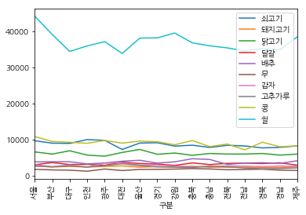


`xticks=np.arange(16)`는 xtick이 보여질 위치를 지정하는 것이다.

- boxplot


```python
%matplotlib inline
from matplotlib import font_manager, rc

font_name = font_manager.FontProperties(fname="c:/Windows/Fonts/NanumGothicBold.ttf").get_name()
rc('font', family=font_name)

df.boxplot()
```


    <matplotlib.axes._subplots.AxesSubplot at 0x1c4b64e68d0>


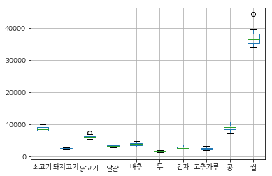


- 파이 그래프


```python
%matplotlib inline
df_excel['Political Party'].value_counts().plot(kind="pie")
```


    <matplotlib.axes._subplots.AxesSubplot at 0x1c4b4a84eb8>


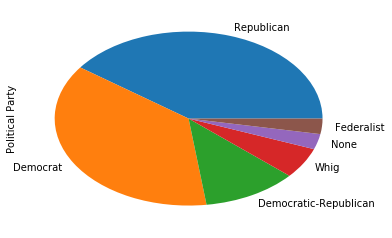


- 바차트


```python
df_excel['Political Party'].value_counts().plot(kind="bar")
```


    <matplotlib.axes._subplots.AxesSubplot at 0x1c4b4fb8518>


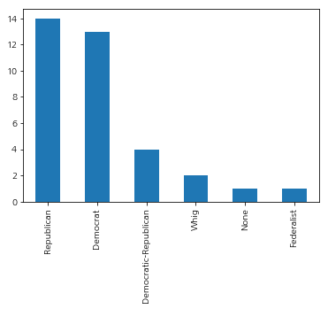


# 영상 데이터
## 참고 사이트
- 파이썬 이미지 처리 블로그: http://pythonstudy.xyz/python/article/406-%ED%8C%8C%EC%9D%B4%EC%8D%AC-%EC%9D%B4%EB%AF%B8%EC%A7%80-%EC%B2%98%EB%A6%AC
- Pillow documentation: https://pillow.readthedocs.io/en/4.2.x/

## 소개

이미지를 저장하는 형식은 jpg, png, tif, gif등 여러 가지가 있다. 이미지는 픽셀(화소)로 구성된다. 다음 설명은 파이썬 모듈 `Pillow`에서 사용되는 형식이다. 이미지를 다루는 도구마다 약간씩 차이가 있다.

### 크기와 좌표(coordinate system)

- 이미지의 크기는 너비(또는 가로, width), 높이(또는 세로, height)로 구성된다. 너비와 높이는 픽셀의 갯수로 결정된다.
- 픽셀은 2차원 좌표로 표현할 수 있다. 이미지의 왼쪽 위가 (0,0)이고, 각 픽셀은 좌표 (x, y)로 나타낸다. 첫번째 성분 x는 너비를 나타내고 두번째 성분 y는 높이를 나타낸다. x는 왼쪽에서 오른쪽으로 증가하고, y는 위에서 아래로 증가한다.
- 이미지의 부분을 표현하기 위해서 사각형을 이용한다. 사각형은 (x, y, z, w)로 표현하며 x, y는 각각 부분 이미지의 왼쪽, 위의 좌표를 나타내고, z, w는 각각 부분 이미지의 오른쪽, 아래의 좌표를 나타낸다. z, w는 포함되지 않는다. (0, 0, 800, 600)은 800x600 크기를 표현한다.

### 모드(mode)
모드는 픽셀값을 구성하는 방법이다.

- 이진 영상(binary image)는 픽셀이 1 비트로 구성되어 있어서 검은색은 0, 흰색은 1로 표현한다.
- 흑백 영상(gray-scale image) 흑백의 표현을 0 - 255의 숫자로 표현한다. 가장 어두운 것은 0, 가장 밝은 것은 255로 표현한다. 하나의 픽셀을 표현하기 위해 8비트가 사용된다.
- 컬러 영상(color image)은 하나의 픽셀을 표현하기 위해서 3개의 색 빨간(R), 초록(G), 파란(B)색을 사용한다. 각각의 R, G, B는 8비트로 이루어져 있으며 0 - 255의 숫자로 표현한다. 숫자가 커지면 각각의 색이 짙어진다. 빚의 삼원색 원리가 적용되어 (255, 255, 255)는 흰색을 나타내고 (0, 0, 0)은 검은색을 나타낸다. 뿐만 아니라 투명도를 표현하기 위해서 Alpha 채널을 추가하여, (R, G, B, A) 4개의 채널을 사용하기도 한다. alpha 채널에서 0는 투명, 255는 불투명을 의미한다. 이외에도 HSV(Hue, Saturation, Intensity), CMYK, YCbCr 모델등 여러 가지가 있다.

### 밴드(band)
밴드 또는 채널(channel)이라고 하며 픽셀을 구성하는 방법으로 흑백은 1 채널을 가지고 있고 컬러 영상은 R, G, B 3개의 채널(밴드)를 가지고 있다. 또는 R, G, B, A이면 4개의 밴드를 가지고 있다.

## 준비

이미지 처리를 하기 위한 모듈 `Pillow`를 설치한다.

```python
pip install Pillow
```

우선 이미지를 웹사이트에서 다운받아 images폴더를 만들고 그 안에 저장한다.


```python
import requests
import os
from io import BytesIO

dir = 'images'
if not os.path.exists(dir):
    os.makedirs(dir)

url = 'https://upload.wikimedia.org/wikipedia/en/2/24/Lenna.png'
response = requests.get(url)
img = Image.open(BytesIO(response.content))

img.save('images/lenna.png')

logo_url = 'https://upload.wikimedia.org/wikipedia/commons/thumb/0/0a/Python.svg/48px-Python.svg.png'
response = requests.get(logo_url)
logo_img = Image.open(BytesIO(response.content))

logo_img.save('images/logo.png')

jisung_url = 'http://i.imgur.com/pbgsMRV.jpg'
response = requests.get(jisung_url)
jisung_img = Image.open(BytesIO(response.content))

jisung_img.save('images/jisung.png')
```

## 읽기/쓰기


```python
from PIL import Image
import matplotlib.pyplot as plt

# 이미지 열기
img = Image.open('images/lenna.png')
 
# 이미지 크기 출력
print(img.format, img.size, img.mode)

# 이미지 보기
plt.imshow(img)

# 이미지 JPG로 저장
img.save('images/lenna.jpg')
```

    (512, 512)
    


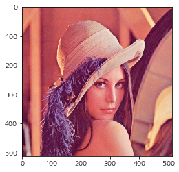


```python
# Thumbnail 이미지 생성
size = (128, 128)
img.thumbnail(size)  
 
img.save('images/lenna-thumb.jpg')
```

## 잘라내기/붙이기

- 잘라내기

사각형 (left, upper, right, lower)을 이용해서 이미지의 부분을 잘라낼 수 있다.


```python
img = Image.open('images/lenna.png')
box = (100, 100, 400, 400)
cropImage = img.crop(box)
cropImage.save('images/lenna-crop.jpg')
plt.imshow(cropImage)
# cropImage.show() # 윈도우즈 기본 그림 보기 프로그램 실행
```


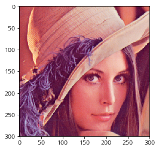


- 붙이기

`paste(region, box)`를 이용해서 `region`이미지를 직사각형 `box` 위치에 붙여 넣을 수 있다. `region`의 크기와 `box`의 크기가 같아야 한다.


```python
img1 = img.copy()
box = (50, 50, 350, 350)
cropImage = img1.crop(box)
region = cropImage.rotate(180)
img1.paste(region, box)
plt.axis("off")
plt.imshow(img1)
```


    <matplotlib.image.AxesImage at 0x1c4b6ab8978>


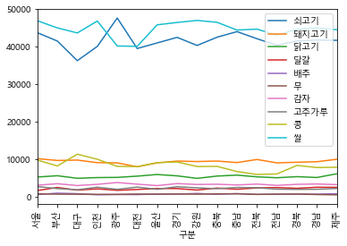


- 파이썬 로고 붙이기


```python
img = Image.open('images/lenna.png')
logo = Image.open('images/logo.png')
img1 = img.copy()
position = ((img1.width - logo.width), (img1.height - logo.height))
# img1.paste(logo, position)
img1.paste(logo, position, logo)
img1.save('images/lenna-logo.jpg')
```

paste 함수의 3번째 인수는 mask이고 mask가 될 수 있는 이미지의 모드는 '1'(이진 영상), 'L'(8비트 흑백 영상), 'RGBA'이다. 'RGBA' 영상을 사용하면 alpha 채널의 값을 mask로 사용하게 된다. 알파 채널에서 0은 투명을 의미하고 255는 불투명을 의미한다.


```python
print("logo의 모드:", logo.mode, "(0,0)에서의 픽셀(r,g,b,a):", logo.getpixel((0,0)))
```

    logo의 모드: RGBA , (0,0)에서의 픽셀(r,g,b,a): (0, 0, 0, 0)
    

`logo` 이미지의 픽셀 (0,0) 위치에서 alpha 밴드의 값이 0(투명)이므로, 기존 이미지 `lenna.png`의 픽셀을 그대로 보여주게 된다.

## 회전 및 크기 변경


```python
from PIL import Image
img = Image.open('images/lenna.png')
 
# 크기를 600x600 으로
img2 = img.resize((600, 600))
img2.save('images/lenna-600.jpg')
 
# 시계 반대 방향으로 90도 회전
img3 = img.rotate(90)
img3.save('images/lenna-rotate.jpg')

plt.imshow(img3)
```


    <matplotlib.image.AxesImage at 0x1c4b7bc44e0>


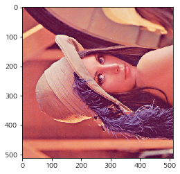


```python
img4 = img.rotate(18)
plt.imshow(img4)
```


    <matplotlib.image.AxesImage at 0x1c4b852c7f0>


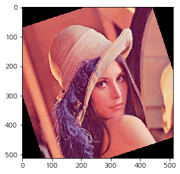


`expand=True` 선택을 하면 전체 그림이 보이며 새로 만들어진 이미지의 크기는 증가한다.


```python
img5 = img.rotate(18, expand=True)
plt.imshow(img5)
```


    <matplotlib.image.AxesImage at 0x1c4b8592358>


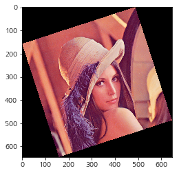


## 필터링

`filter()` 함수와 BLUR, CONTOUR, DETAIL, EDGE_ENHANCE, EDGE_ENHANCE_MORE, EMBOSS, FIND_EDGES, SMOOTH, SMOOTH_MORE, SHARPEN등의 필터들을 사용하여 이미지를 변형한다.

- 블러링


```python
from PIL import Image, ImageFilter
 
img = Image.open('images/lenna.png')
blurImage = img.filter(ImageFilter.BLUR)
 
blurImage.save('images/lenna-blur.png')
```

transpose(method) 함수와 method 인자을 이용하여 이미지를 변형할 수 있다. method가 될 수 있는 것은PIL.Image.FLIP_LEFT_RIGHT, PIL.Image.FLIP_TOP_BOTTOM, PIL.Image.ROTATE_90, PIL.Image.ROTATE_180, PIL.Image.ROTATE_270 or PIL.Image.TRANSPOSE이 있다.


```python
img = Image.open('images/lenna.png')
flipImage = img.transpose(Image.FLIP_LEFT_RIGHT)
 
plt.imshow(flipImage)
```


    <matplotlib.image.AxesImage at 0x1c4b9c29a90>


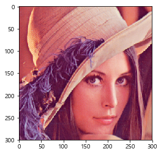


## 점(픽셀) 연산
`point()` 함수를 이용하여 각 픽셀에 대한 연산을 수행하여 픽셀의 값을 변경할 수 있다.


```python
# multiply each pixel by 1.2, 전체적으로 이미지가 밝아지는 효과
out = img.point(lambda i: i * 1.2)
plt.imshow(out)
```


    <matplotlib.image.AxesImage at 0x1c4b9cb1f28>


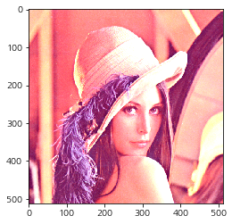


- 채널에 대한 연산을 수행


```python
# split the image into individual bands
source = img.split()

R, G, B = 0, 1, 2

# 빨간색이 100 보다 크면 255, 그렇지 않으면 0
mask = source[R].point(lambda i: i > 100 and 255)

# 녹색 채널의 값을 줄인다.
out = source[G].point(lambda i: i * 0.7)

# paste the processed band back, but only where red was < 100
source[G].paste(out, None, mask)

# build a new multiband image
img1 = Image.merge(img.mode, source)

plt.imshow(img1)
```


    <matplotlib.image.AxesImage at 0x1c4b864fac8>


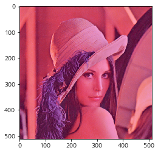


`x and y` 연산은 x가 거짓(0)이면 결과값은 x(0)이고 참이면 결과값은 y가 된다.

# 얼굴 인식

## 참고 사이트
- 라즈베리 파이 얼굴: http://blog.naver.com/PostView.nhn?blogId=cosmosjs&logNo=220723987718&categoryNo=0&parentCategoryNo=56&viewDate=&currentPage=1&postListTopCurrentPage=1&from=postView
- dlib: http://dlib.net/face_recognition.py.html

## 준비

- opencv설치
```python
pip install opencv
conda install -c menpo opencv # 아나콘다
```

- dlib 설치
```python
pip install dlib
conda install -c menpo dlib # 아나콘다
```

- xml 파일들 다운로드


```python
import urllib.request
import os

directory = 'xmls'
if not os.path.exists(directory):
    os.makedirs(directory)

files = ['haarcascade_frontalface_default.xml',
         'haarcascade_eye.xml']

for file in files:
    url = 'https://raw.githubusercontent.com/opencv/opencv/master/data/haarcascades/' + file
    fpath = directory + '/' + file
    if not os.path.exists(fpath):
        urllib.request.urlretrieve(url, fpath)
```

- dlib model 파일 다운로드

[http://dlib.net/files/](http://dlib.net/files/)로부터 필요한 파일들 `shape_predictor_68_face_landmarks.dat.bz2`을 다운로드 받는다.


```python
import urllib.request
import os

directory = 'models'
if not os.path.exists(directory):
    os.makedirs(directory)

files = ['shape_predictor_68_face_landmarks.dat.bz2']

for file in files:
    url = 'http://dlib.net/files/' + file
    fpath = directory + '/' + file
    if not os.path.exists(fpath):
        urllib.request.urlretrieve(url, fpath)
```

## 사진

- opencv 이용

```python
import numpy as np
import cv2

face_cascade = cv2.CascadeClassifier('xmls/haarcascade_frontalface_default.xml')
eye_casecade = cv2.CascadeClassifier('xmls/haarcascade_eye.xml')

img = cv2.imread('images/jisung.png')

# 컬러를 회색 영상으로 변환
gray = cv2.cvtColor(img, cv2.COLOR_BGR2GRAY)

# scaleFactor = 1.1은 0.1 * 100 % = 10 %로 그림을 줄여 나가면서 얼굴을 찾는다.
# 숫자가 작으면 더 정확하게 얼굴들을 찾아내지만 시간이 많이 걸리고 또한 얼굴이 아닌 것을 찾을 가능성이 커진다.
# scaleFactor는 1보다 커야 한다.
# minNeighbors = 5는 후보가 되는 사각형을 적어도 5개의 사각형들이 포함하고 있어야 한다는 것이다.
#  갯수가 많아지면 더 정확한 얼굴을 찾지만 그만큼 원하는 얼굴들을 찾지 못할 수 있다.
# 탐색된 얼굴에 대한 직사각형 리스트 반환
faces = face_cascade.detectMultiScale(gray, 1.1, 5)

for (x, y, w, h) in faces:
    # 이미지에 탐색된 얼굴 직사각형 표시
    # 두번째 인자 (x, y)는 직사각형의 왼쪽 위, 3번째 인자 (x+w, y+h)는 직사각형의 오른쪽 아래,
    # 4번째 인자 (255, 0, 0)는 직사각형 색,
    # 다섯번째 인자 2는 직사각형 둘레의 두께
    cv2.rectangle(img, (x, y), (x+w, y+h), (255, 0, 0), 2)
    # 탐색된 얼굴부분만 변수로 저장
    roi_gray = gray[y:y+h, x:x+w]
    roi_color = img[y:y+h, x:x+w]

    # 얼굴 부분에서 눈 탐색
    eyes = eye_casecade.detectMultiScale(roi_gray)
    for (ex, ey, ew, eh) in eyes:
        # 탐색된 얼굴 부분에 탐색된 눈 부분 직사각형 표시
        cv2.rectangle(roi_color, (ex, ey), (ex+ew, ey+eh), (0, 255, 0), 2)

cv2.imshow('Face Detection', img)
cv2.waitKey(0)
cv2.destroyAllWindows()
```

- dlib 이용

```python

```

## 비디오

### 참고 사이트

- https://realpython.com/blog/python/face-detection-in-python-using-a-webcam/

- https://github.com/shantnu/Webcam-Face-Detect

- 얼굴 인식

```python
import cv2
import sys
import datetime as dt
from time import sleep

cascPath = "xmls/haarcascade_frontalface_default.xml"
faceCascade = cv2.CascadeClassifier(cascPath)

video_capture = cv2.VideoCapture(0)
anterior = 0

while True:
    if not video_capture.isOpened():
        print('Unable to load camera.')
        sleep(5)
        pass

    # Capture frame-by-frame
    ret, frame = video_capture.read()

    gray = cv2.cvtColor(frame, cv2.COLOR_BGR2GRAY)

    faces = faceCascade.detectMultiScale(
        gray,
        scaleFactor=1.1,
        minNeighbors=5,
        minSize=(30, 30)
    )

    # Draw a rectangle around the faces
    for (x, y, w, h) in faces:
        cv2.rectangle(frame, (x, y), (x+w, y+h), (0, 255, 0), 2)

    if anterior != len(faces):
        anterior = len(faces)

    # Display the resulting frame
    cv2.imshow('Video', frame)


    if cv2.waitKey(1) & 0xFF == ord('q'):
        break

# When everything is done, release the capture
video_capture.release()
cv2.destroyAllWindows()
```

# 라즈베리 파이 및 아두이노
