# 영상/스트리밍 데이터와 얼굴 인식

## 프로그램 소개

- 데이터 유형
- 데이터의 중요성
- 데이터 수집/가공/분석 체험: 문서 통계 분석, 사진 
- 고급활용(얼굴, 사물 인식) 체험

## 보조 진행자

- 김찬준(11시 - 12시)
- 김진모(13시 - 15시)
- 황선재(11시 - 15시)
- 정아연(11시 - 12시)

## 진로체험의 중요성 및 영향

- 이 수업을 통해 데이터의 수집, 가공, 분석하는 방법을 체험함으로 데이터에 대한 막연한 생각들을 구체화한다.
- 데이터의 활용 예제를 직접 수행함으로 어렵지 않게 접근할 수 있다는 자신감을 얻는다.
- 이 경험을 바탕으로 넓고 다양한 직업에 대한 가능성을 엿볼 수 있다.

# 데이터

## 데이터 유형 및 응용

- 문서 데이터(정형: 표, 엑셀 데이터, 데이터 베이스(DB), 비정형: 웹 문서, SNS, 로그 데이터)
    - 연관성 분석: 연관 검색어([구글](https://www.google.com/search?q=날씨), 네이버)
    - 추천 시스템: 온라인 쇼핑([아마존](https://amazon.com))
    - 교통 정보: 실시간 빠른 길
    - 의료: [인공 지능 왓슨](http://www.sciencetimes.co.kr/?news=%EC%99%93%EC%8A%A8-%EC%A0%95%EB%B0%80%EC%9D%98%EB%A3%8C-%EC%8B%9C%EB%8C%80-%EC%97%B4%EA%B9%8C)(자연어 처리, 기계 학습)
- 영상 데이터(정지 영상, 동영상)
    - 사진 분류: [구글 "AI 이미지인식, 인간 능력 넘어설 것"](http://biz.chosun.com/site/data/html_dir/2017/03/26/2017032600545.html)
    - 사물 인식: [Object Recognition by Scene Alignment](http://bryanrussell.org/projects/recognitionBySceneAlignment/index.html)
    - 회화: [AI가 그린 그림 900만원에 팔려···예술 넘보는 인공지능](http://news.joins.com/article/19853826)
- 음성 데이터
    - 활용: 음성인식, 음성 변조, 작곡
    - 음성 비서: 애플 시리, 아마존 알렉사, 구글 어시스턴트

# 파이썬

파이썬(Python)은 1991년 프로그래머인 귀도 반 로섬(Guido van Rossum)이 발표한 고급 프로그래밍 언어이다. 파이썬이라는 이름은 귀도가 좋아하는 코미디 프로인 '몬티 파이썬의 하늘을 나는 서커스'(Monty Python's Flying Circus)에서 따온 것이라고 한다.


## 파이썬 특징

- **배우기 쉽다.** 초보자가 배우기에 다른 언어에 비해서 쉽고 문법도 간단하다.
- **오픈소스이고 무료이다.** 자유롭게 배포할 수 있고 원하는대로 수정할 수 있으며 사용할 수 있다.
- **높은 수준(high-level)의 언어이다.** 사람들이 읽고 쓰기 편리한 언어를 말한다. 메모리 관리와 같은 저수준의 프로그래밍을 할 필요가 없다. 저수준(low-level)이라고해서 안좋다는 뜻이 아니고 초보자들이 접근하기 어려운 수준이라고 생각하면 될 것 같다.
- **호환 가능.** 윈도우즈, 리눅스, 맥 등 여러 운영체제에서 같은 코드를 실행할 수 있다.
- **인터프리터 형식.** `C/C++` 같은 프로그래밍 언어는 소스코드를 컴파일한 후 실행하는 과정을 거치지만 파이썬은 소스코드를 컴파일하는 과정이 필요없고 한 줄, 한 줄씩 실행할 수 있다.
- **플랫폼 독립적(Platform Independence)이다.** 외형적으로 인터프리터 방식이지만 내부적으로는 중간 언어인 바이트 코드 파일(.pyc)을 생성하기 때문에, 운영체제에 상관없이 실행할 수 있다.
- **객체지향적이다.** 객체를 중심으로 데이터와 함수를 프로그래밍하기 편리하다.
- **방대한 라이브러리.** 정규 표현식, 문서 생성, 단위 테스트, 스레드, 데이터베이스, 웹브라우저, CGI, FTP, HTML, WAV 파일, GUI등 방대한 양의 표준 라이브러리들을 사용할 수 있다.

## 파이썬 설치

파이썬 홈페이지 [https://www.python.org/](https://www.python.org/)에서 파이썬 [최신 버전](https://www.python.org/downloads/)을 다운받아 설치하는 방법과 아나콘다 프로그램을 [다운(https://www.continuum.io/downloads)](https://www.continuum.io/downloads)받아 설치하는 방법이 있다.

여기서는 아나콘다를 이용해서 파이썬을 설치해본다. 아나콘다를 설치하면 파이썬 프로그램뿐만 아니라 자주 사용되는 패키지들(Jupyter, Spyder, Numpy, SciPy, Pandas, matplotlib 등)이 기본적으로 설치되기 때문에 처음 사용자에게 편리하다. 또한 파이썬 버전과 호환되는 패키지들을 선택해서 설치하기 때문에 번거로움을 덜 수 있다.

## 아나콘다

### <a name="시스템종류확인"></a>시스템 종류 확인

아나콘다를 설치하기 전, 먼저 자신의 컴퓨터가 64비트인지 32비트인지를 확인하고, 맞는 프로그램을 다운로드하고 설치해야한다. 확인하는 방법은 제어판 - 시스템을 클릭해서 시스템 종류를 보고 확인할 수 있다


### 아나콘다 다운로드

아나콘다 다운로드 홈페이지 [https://www.anaconda.com/download/](https://www.anaconda.com/download/)에 접속한다. 윈도우즈 파이썬 3.x 버전을 선택한다. 이것을 쓸 때 3.6버전이 최신 버전이다. 위에서 확인 시스템 종류에 맞는 버전을 클릭하여 다운로드 한다.


### 설치

다운로드 받은 파일을 클릭하여 설치를 시작한다.

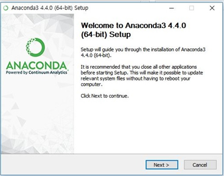

아나콘다 프로그램을 사용자 혼자만 사용하게 할 것인지 모든 사용자가 사용하게 할 것인지를 선택하는 항목이다. 추천 항목인 Just Me를 선택한다.


아나콘다 설치 폴더는 자유롭게 선택할 수 있지만 폴더 경로에 빈 칸이 들어가면 문제가 될 수 있으므로 피해야 한다. 예를 들어 `c:\Program Files\Anaconda`와 같이 `Program`과 `Files`사이에 빈 칸으로 연결된 경로를 피해야 한다.

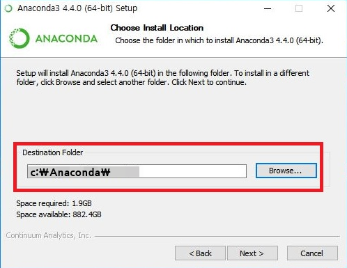

아나콘다에서 제공되는 파이썬 프로그램을 윈도우즈 기본 파이썬 프로그램으로 등록할지를 확인하는 항목이다. 다음 그림과 같이 선택한다.

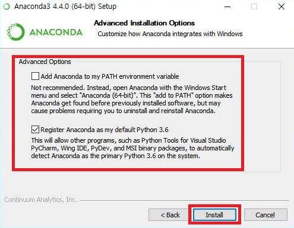


## 명령어창에서 파이썬 실행

아나콘다(파이썬) 프로그램이 설치되었으면 실행창에서 간단한 파이썬 명령어들을 실행해보자. 아나콘다 실행창을 열어보자. 

1. 시작 버튼을 누르고
1. 프로그램 중에서 아나콘다(Anaconda)를 찾아서 누른다. 
1. 부메뉴 중에서 Anaconda Prompt를 눌러서 아나콘다 실행창을 연다.


아나콘다 실행창에서 `python`을 실행한다.

<!---->


<!-- 만일 위와 같이 파이썬 실행 표시가 나오지 않는다면 파이썬 설치 경로를 시스템 환경에 설정해 줘야 한다. [시스템 경로 설정](#시스템 경로 설정)을 참고한다.

### <a name="시스템 경로 설정"></a> 시스템 경로 설정

제어판 -> 시스템 -> 고급 시스템 설정 -> 고급 탭 -> 환경변수를 클릭한다. 시스템 변수 항목 중에서 Path 변수를 선택 후 편집을 누른다. 새로 만들기를 눌러서 아나콘다(또는 파이썬) 설치 폴더 및 아나콘다(또는 파이썬) 설치 폴더/Scripts들을 새로 만든 후 확인을 계속 눌러서 창들을 닫는다. 그리고 명령어창을 ***새롭게*** 열어서 위의 명령어를 다시 실행해본다. -->

간단한 명령어들을 실행해보자.

<!---->


파이썬 실행을 끝내려면 `exit()`를 입력하고 엔터를 치든지, `Ctrl + Z`를 누르고 엔터를 치면 파이썬 프로그램을 닫는다.

<!---->


## 스크립트 파일 실행

명령어들을 한 줄 한 줄 입력해서 실행하기에 불편한 점이 많다. 여러 명령어들을 일괄적으로 실행하기위해서는 파일에 필요한 명령어들을 저장한다. 그리고 그 파일을 한꺼번에 실행할 수 있다. 또한 잘못된 곳이 있으면 그 파일 내용을 수정하여 다시 실행할 수 있다. 이러한 파일을 스크립트 파일이라고 부른다. 앞으로 실습을 위해서 작업 폴더를 만들어 보자.

### 실습 폴더 만들기

아나콘다 실행창에서 다음과 같이 실행한다.

1. `cd \`를 해서 맨 위의 폴더로 간다. `cd`는 change directory는 폴더의 위치를 변경하는 명령어이다. `\`는 역슬래시(백슬래시)라고 하며 한글 키보드 엔터키 바로 위에 &#8361;과 같은 키이다.
1. `mkdir work`를 해서 `work` 폴더를 새로 만든다. 이미 `work` 폴더가 있으면 `하위 디렉터리 또는 파일 work이(가) 이미 있습니다.`라는 메시지가 표시될 것이다. 무시하고 다음 단계로 넘어간다. `mkdir`은 make directory로 새로운 폴더를 만드는 명령어이다.
1. `cd work`를 해서 `work` 폴더로 들어간다.


### 스크립트 파일 만들기

간단한 실습을 위해서 다음과 같이 메모장(notepad.exe) 프로그램을 이용해서 파일을 만들어 저장한다.

아나콘다 실행창에 `notepad example.py`라고 입력하고 엔터를 친다. 그러면 메모장이 실행되면서 `example.py` 파일이 없으면 새롭게 만들거냐고 물어볼 것이다. 그러면 `예`를 누른다. 그렇지 않고 이미 `example.py` 파일이 존재하면 그 파일이 열린다.

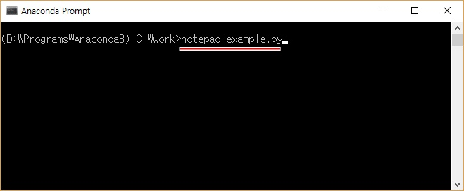


열린 메모장에서 다음과 같이 입력한 후 저장(Ctrl + S를 누르거나 매뉴의 파일 - 저장을 누른다)한다.


아나콘다 실행창에서 `python example.py`를 입력하여 실행하면 다음과 같은 결과를 확인할 수 있다.


메모장 `example.py` 내용을 숫자를 바꾸어 저장한 후, 아나콘다 실행창에서 `python example.py` 다시 실행하면 결과가 다르게 나오는 것을 확인할 수 있을 것이다.

간단한 실습을 위해서 메모장을 사용한 것이지 앞으로 프로그래밍을 할 때는 사용하지 않을 것이다. 파이썬 프로그래밍을 편하게 할 수 있는 전용 편집기 PyCharm을 사용할 것이다.

## 통합 개발환경 파이참(PyCharm)

파이썬 프로그래밍을 효율적으로 할 수 있게 도와주는 프로그램인 PyCharm 통합개발환경 Community Edition에 대해서 알아본다. PyCharm Community Edition은 무료이고 오픈소스이다. 파이참은 파이썬 편집을 할 때 필요한 함수들을 자동으로 완성해주는 기능 및 도움말도 쉽게 살펴 볼 수 있다. 또한 실행 및 디버깅도 쉽게 할 수 있고 파일의 버전 제어(svn, git) 기능도 사용할 수 있다.

### 파이참 다운로드

파이참 다운로드 홈페이지 https://www.jetbrains.com/pycharm/download/에 접속해서 Community Edition을 다운 받는다.


### 파이참 설치

다운로드 받은 파일을 클릭하여 설치를 시작한다.

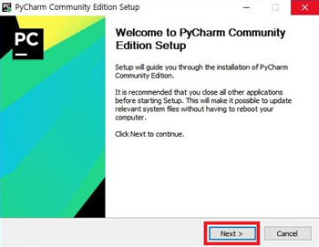

설치 폴더를 정하는 화면이다. 기본 설정 폴더로 한다.


32비트 또는 64비트를 설치할 건지 선택하는 화면이다. 아나콘다 설치시 살펴봤던 [시스템 종류 확인](#시스템종류확인)에서 확인한 정보를 이용해서 선택한다.


파이참을 실행하면, 기존의 파이참 설정 파일을 가져올 건지를 물어보는 항목이다. 처음 설치하는 것이므로 `Do not import settings`를 선택한다.

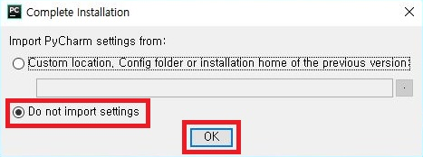

라이선스 동의 화면이다. `Accept`를 누른다.

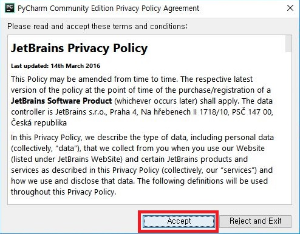

파이참 테마를 설정하는 부분이다. 기본 설정을 따른다.

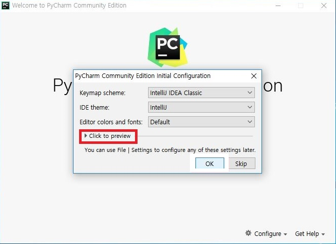

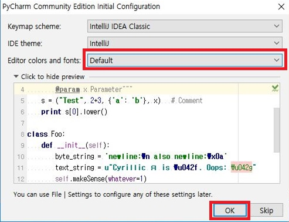

새로운 프로젝트를 생성한다.


새로운 프로젝트 위치와 이름을 설정한다. `C:\work\sample1`이라고  설정하자.


### 파이참 테마 변경

파이참 기본 테마를 변경하는 방법에 대해 알아본다. File - Settings를 눌러서 Settings 팝업창을 띄운다.


Settings 창에서

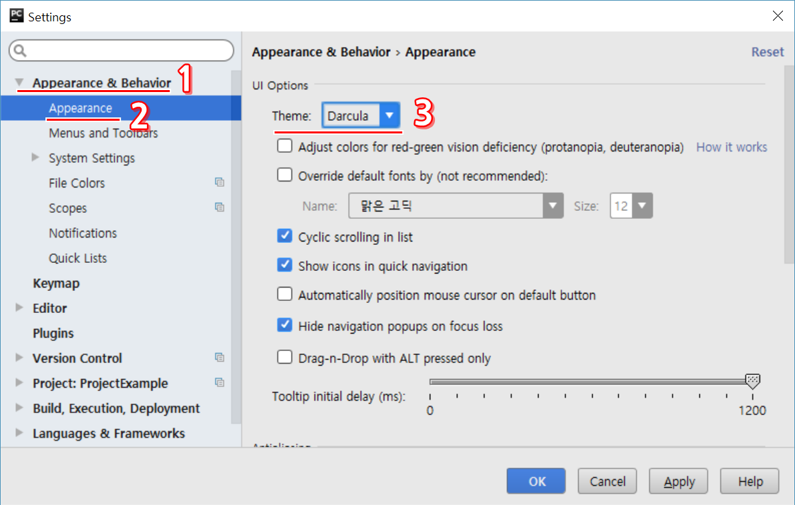

1. Appearance & Behavior를 누르고
1. Apperance를 선택한다.
1. Theme 항목에서 원하는 항목을 선택하면 된다. 기본 설정은 IntelliJ이다. 앞으로 여기서는 Darcula 테마를 사용할 것이다.

다음은 Darcula 테마를 적용한 화면이다.


### 새로운 프로젝트 만들기 및 실행

파이참을 사용하기 위해서는 먼저 프로젝트를 만들어야 한다. 메뉴에서 File - New Project을 눌러서 새로운 프로젝트를 만든다.

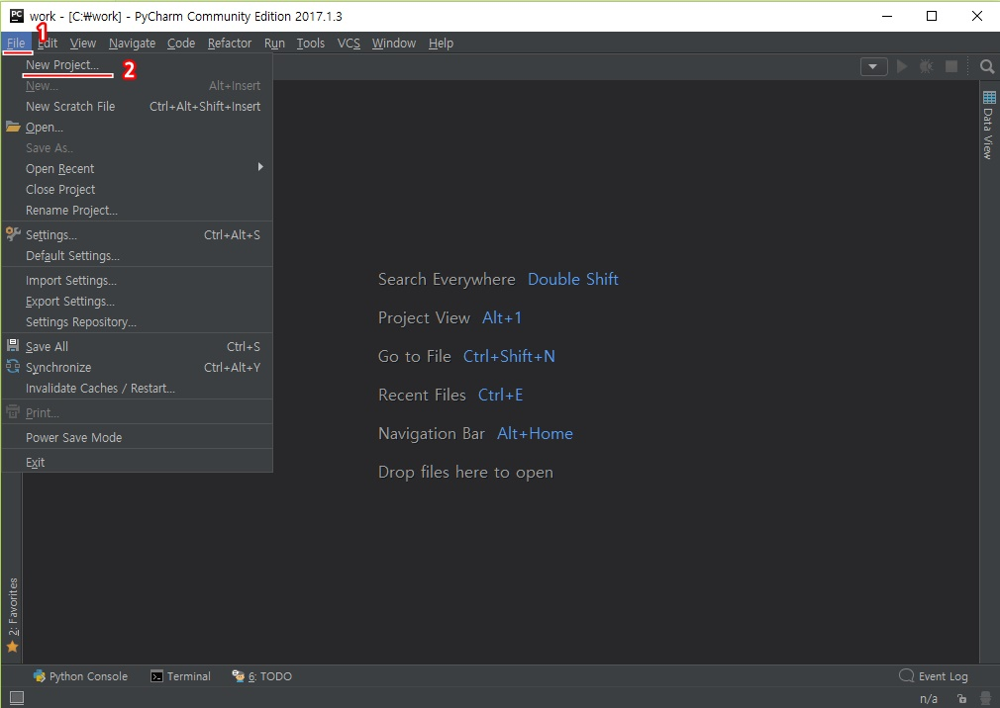

새로운 프로젝트 위치와 이름을 다음과 그림과 같이 `C:\work\ProjectExample` 폴더로 정한다.


1. 오른쪽 `...`을 눌러서 원하는 폴더를 선택한다.
1. `c:\work` 폴더를 선택 후 확인을 누른다.
1. `Location:` 항목에서 `c:\work\ProjectExample`이라고 입력을 한다.

프로젝트에 새로운 파일을 만들어 보자.

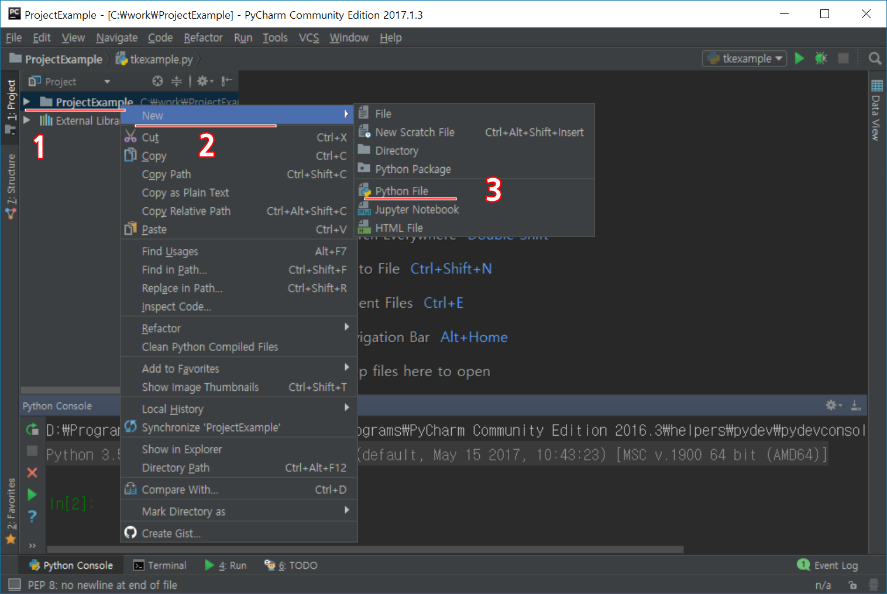

1. 왼쪽편에 있는 프로젝트 이름을 마우스 오른쪽 클릭하고
1. New를 누른 후
1. Python File을 누르면 팝업창이 뜬다.


1. `Name` 항목에 `FirstEx`라고 쓰고 확인을 누른다.

간단한 프로그램을 작성하고 실행해 본다.


1. 편집창에 `print('Hello world, 안녕')`이라고 적는다.
1. 편집창에서 마우스 오른쪽 클릭하여 `Run FirstEx`를 누른다.
1. 편집창 아래에 결과 `Hello world, 안녕`이 보일 것이다.

프로젝트에 새로운 파일을 추가하고 싶으면 위와 같은 방법을 반복하면된다.


## 파일 이름

주의: 스크립트 파일 이름을 저장할 때 기존 모듈 이름으로 저장하고 import 모듈 하면 프로그램이 제대로 동작하지 않을 수 있다. 예를 들면 사용자가 파일 이름을 `mymodule.py`라고 저장했다고 하자. 그런데 파이썬이 이미 그와 같은 모듈을 갖고 있어서 사용자가 파이썬이 내장하고 있는 `mymoule` 모듈을 불러오려고 다음과 같이 쓰면 사용자가 저장했던 `mymoudle.py`가 불어와지게 되어 제대로 작동하지 않을 수 있다.

```python
import mymodule

....
....
```

어떻게 파일 이름을 지을 지 고민될 때는 원하는 파일 이름 뒤에 `Ex` 또는 자신의 영문 대문자를 사용하는 것도 좋은 방법이다. 예를 들면 파일이름을 `mymodule`이라고 짓고 싶을 때는 `mymoduleEx` 또는 `mymoduleDyoon`이라고 하면 크게 문제가 없을 것이다.

#  문서 데이터

## 데이터 수집 및 파싱(Parsing)

### 웹 페이지 읽기
 
`requests` 모듈을 이용하여 웹 페이지를 읽어 올 수 있다.
 
- 다음(daum) 홈페이지에 접속해서 HTML 문서를 가져와 화면에 출력하는 예이다.


```python
import requests

resp = requests.get( 'http://daum.net' )
 
if (resp.status_code == requests.codes.ok):
    html = resp.text
html.split('\n')[0:10]
```


    ['<!DOCTYPE html>',
     '<html lang="ko" class="">',
     '<head>',
     '<meta charset="utf-8"/>',
     '<title>Daum</title>',
     '<meta property="og:url" content="https://www.daum.net/">',
     '<meta property="og:type" content="website">',
     '<meta property="og:title" content="Daum">',
     '<meta property="og:image" content="//i1.daumcdn.net/svc/image/U03/common_icon/5587C4E4012FCD0001">',
     '<meta property="og:description" content="나의 관심 콘텐츠를 가장 즐겁게 볼 수 있는 Daum">']


** 직접하기 **

- [구글 홈페이지](http://google.com)를 가져와 출력해보자.
- [네이버 홈페이지](http://naver.com)를 가져와 출력해보자.

## 파싱(Beautiful Soup)

BeautifulSoup 모듈을 이용해서 웹 페이지에서 필요한 정보들을 찾아낼 수 있다.

- 설치

```python
pip install beautifulsoup4 # 또는
conda install beautifulsoup4 # 아나콘다를 이용할 경우
```

- BeautifulSoup 웹페이지 파싱

웹 문서를 입력받아 bs객체를 만든다. bs 객체를 이용하여 필요한 정보들에 접근해서 원하는 것들을 수집할 수 있다. 원하는 성분으로 접근하는 방법은 여러 가지가 있으나 select() 함수를 이용하는 방법이 있다. select 함수의 인자는 css selector 조합 문자열을 사용한다. css selector에 대한 자세한 설명은 [W3 Schools CSS Selector Reference](https://www.w3schools.com/cssref/css_selectors.asp)를 참조한다. 다음은 몇 가지 예를 보여준다.

| Selector | 예제 | 설명 | CSS 버전 |
| ---- | ---- | ----- | ---- | ----- |
|`.class` | `.intro` | `class="intro"`인 모든 성분 선택 | 1 |
|`#id` | `#firstname` | `id="firstname"`인 모든 성분 선택 | 1 |
| `*` | `*` | 모든 성분 선택 | 2 |
|`element` | `p` | `<p>` 성분 모두 선택 | 1 |
|`element, element` | `div, p` | `<div>` 또는 `<p>`를 갖는 모든 성분 선택 | 1 |
|`element element` | `div p` | `<div>` 성분 안에 `<p>` 성분을 갖는 모든 성분 선택| 1 |
|`element>element` | `div > p` | 부모가 `<div>`인 모든 `<p>` 성분 선택 | 2 |
|`element+element` | `div + p` | 바로 위의 부모가 `<div>`인 모든 `<p>` 성분 선택 | 2 |
|`element1~element2` | `p ~ ul`| `<p>` 바로 다음에 있는 `<ul>` 성분들 선택 | 3 |
|`[attribute]` | `[target]` | 속성이 `target`인 모든 성분 선택 | 2 |
|`[attribute=value]` | `[target=_blank]` | 속성이 `target`이고 `target`의 값이 `_blank`인 모든 성분 선택 | 2 |
|`[attribute~=value]` | `[title~=flower]` | `title`속성을 갖고 속성값이 `flower`단어를 포함하는 모든 성분들 선택 | 2 |
|`[attribute` &#124;`=value`] | `[lang` &#124; `=en`] | 속성이 `lang`이고 속성의 값이 `en`으로 시작하는 모든 성분 선택 | 2 |


```python
import bs4
 
html = "<html><head><title>제목</title></head><body>...생략...</body></html>"
bs = bs4.BeautifulSoup(html, 'html.parser')
bs.select('body')
```


    [<body>...생략...</body>]


- 네이버 금융 사이트에서 헤드라인 뉴스 제목 발췌


```python
import requests
import bs4
 
resp = requests.get('http://finance.naver.com/')
resp.raise_for_status()

html = resp.text
 
bs = bs4.BeautifulSoup(html, 'html.parser')
print(bs.prettify()[0:100], "\n.\n.\n.\n", bs.prettify()[-100:])

tags = bs.select('div.news_area h2 a') # 헤드라인 뉴스 제목
title = tags[0].getText()
print("헤드라인 제목: ", title)
```

    <html lang="ko">
     <head>
      <title>
       네이버 금융
      </title>
      <meta content="text/html; charset=utf-8" h 
    .
    .
    .
     , 이미지 리플레시 
    jindo.$Fn(mainPageDomReadyFn).attach(document, "domready");
      </script>
     </body>
    </html>
    헤드라인 제목:  수능 연기됐지만…16일 증시, 10시 개..
    

** 직접하기 **

- `news.naver.com` 사이트에서 "이 시각 주요 뉴스" 제목들을 출력하자.

## Selenium 웹 브라우저 자동화

Selenium은 웹 브라우저의 기능을 하도록 하는 모듈이다. 브라우저를 실행하지 않고 함수들을 이용해서 웹 브라우저를 대신할 수 있게 한다. 그러기위해서는 드라이버를 다운로드 해야 한다.

### 드라이버 다운로드

`phantomjs` 드라이버를 인터넷으로부터 다운받아 `drivers` 폴더에 넣는다.


```python
import urllib.request
import os

directory = 'drivers'
if not os.path.exists(directory):
    os.makedirs(directory)

url = 'https://bitbucket.org/ariya/phantomjs/downloads/phantomjs-2.1.1-windows.zip'

fpath = directory + '/' + 'phantomjs-2.1.1-windows.zip'

if not os.path.exists(fpath):
    urllib.request.urlretrieve(url, fpath)

```

### 압축해제

다운받은 파일을 압축해제한다.


```python
import zipfile
zip_ref = zipfile.ZipFile(fpath, 'r')
zip_ref.extractall(directory)
zip_ref.close()
```

### 압축해제된 경로 연결


```python
filename = os.path.split(url)[1] # 파일 이름 추출
file_ext = os.path.splitext(filename) # 파일이름과 확장자로 분리

phantom_path = directory + '/' + file_ext[0] + '/bin/phantomjs.exe'
```

### 사이트에서 원하는 부분 가져오기
[행정안전부 지방물가정보](http://www.mois.go.kr/frt/sub/a02/farmProductPriceList/screen.do) 사이트에 있는 2016년 1월 농축산물 평균가격을 가져와보자.


```python
import requests
import bs4
from selenium import webdriver
from selenium.webdriver.support.ui import Select
import pandas as pd

# 사이트에서 웹 문서 수집
site = 'http://www.mois.go.kr/frt/sub/a02/farmProductPriceList/screen.do'
resp = requests.get(site)
html = resp.text

# 파싱하여 원하는 프레임 가져오기
bs = bs4.BeautifulSoup(html, 'html.parser')
iframes = bs.select('iframe')
for iframe in iframes:
    frame_site = iframe.attrs['src']

# 2016년 1월 클릭
driver = webdriver.PhantomJS(executable_path=phantom_path)
driver.get(frame_site)

elem = driver.find_element_by_id('year')
select = Select(elem)
select.select_by_value("2016")
elem = driver.find_element_by_id('month')
select = Select(elem)
select.select_by_value("01")

driver.find_element_by_id('srch').click()
html = driver.page_source

soup = bs4.BeautifulSoup(html, 'html.parser')
df = pd.read_html(html)
print(df)
driver.close()
```

    [    구분    쇠고기   돼지고기   닭고기    달걀    배추    무    감자  고추가루      콩      쌀
    0   서울  43721  10202  5308  1712   644  842  3136  2762   9818  46908
    1   부산  41505   9714  5652  2529  1010  746  3526  2231   8257  45000
    2   대구  36277   9817  4973  1820   865  731  3039  1913  11383  43656
    3   인천  40072   9139  5163  2156   582  697  3361  2597  10043  46833
    4   광주  47633   9073  5211  1769   664  677  3845  2026   8152  40187
    5   대전  39511   8028  5543  1998   628  785  3413  2632   8072  40087
    6   울산  41000   9083  5980  2249   776  731  3019  2049   9149  45820
    7   경기  42482   9551  5621  2234   760  804  3565  2729   9319  46451
    8   강원  40326   9430  4952  1843   926  738  3326  2432   8104  46989
    9   충북  42524   9563  5566  2370   712  837  3391  2196   8148  46490
    10  충남  44010   9163  5812  2054   883  843  3196  2527   6762  44427
    11  전북  42120   9977  5357  2404   699  671  3433  2454   5989  44677
    12  전남  40382   9074  5119  2504   726  748  3081  2078   6128  43056
    13  경북  41509   9244  5405  2308   810  755  3366  2022   8399  44644
    14  경남  41783   9387  5183  2590   747  649  3457  2049   7839  45013
    15  제주  41694  10031  6175  2563   858  567  3287  2262   7912  44517]
    

`pd.read_html('site address')`을 이용하여 웹 페이지에 있는 표(table)를 pandas DataFrame 리스트로 변환한다.

## 분석

### pandas
`pandas` 모듈은 데이터를 다루기 편리한 함수들을 제공한다.

#### 생성

- 엑셀 데이터 읽기


```python
import pandas as pd

df_excel = pd.read_excel('http://qrc.depaul.edu/Excel_Files/Presidents.xls')
```

- 웹페이지 표 읽기(행정안전부 지방 물가 정보)

위에서 구한 농축산물 전월 평균 가격정보를 가져오자.


```python
df = df[0]
print(df)
```

        구분    쇠고기   돼지고기   닭고기    달걀    배추    무    감자  고추가루      콩      쌀
    0   서울  43721  10202  5308  1712   644  842  3136  2762   9818  46908
    1   부산  41505   9714  5652  2529  1010  746  3526  2231   8257  45000
    2   대구  36277   9817  4973  1820   865  731  3039  1913  11383  43656
    3   인천  40072   9139  5163  2156   582  697  3361  2597  10043  46833
    4   광주  47633   9073  5211  1769   664  677  3845  2026   8152  40187
    5   대전  39511   8028  5543  1998   628  785  3413  2632   8072  40087
    6   울산  41000   9083  5980  2249   776  731  3019  2049   9149  45820
    7   경기  42482   9551  5621  2234   760  804  3565  2729   9319  46451
    8   강원  40326   9430  4952  1843   926  738  3326  2432   8104  46989
    9   충북  42524   9563  5566  2370   712  837  3391  2196   8148  46490
    10  충남  44010   9163  5812  2054   883  843  3196  2527   6762  44427
    11  전북  42120   9977  5357  2404   699  671  3433  2454   5989  44677
    12  전남  40382   9074  5119  2504   726  748  3081  2078   6128  43056
    13  경북  41509   9244  5405  2308   810  755  3366  2022   8399  44644
    14  경남  41783   9387  5183  2590   747  649  3457  2049   7839  45013
    15  제주  41694  10031  6175  2563   858  567  3287  2262   7912  44517
    

- 데이터 프레임 내용 출력


```python
df['구분'] # Series 형으로 출력
```


    0     서울
    1     부산
    2     대구
    3     인천
    4     광주
    5     대전
    6     울산
    7     경기
    8     강원
    9     충북
    10    충남
    11    전북
    12    전남
    13    경북
    14    경남
    15    제주
    Name: 구분, dtype: object


```python
df[['구분', '쇠고기', '감자']] # DataFrame형 출력
```


<div>
<style>
    .dataframe thead tr:only-child th {
        text-align: right;
    }

    .dataframe thead th {
        text-align: left;
    }

    .dataframe tbody tr th {
        vertical-align: top;
    }
</style>
<table border="1" class="dataframe">
  <thead>
    <tr style="text-align: right;">
      <th></th>
      <th>구분</th>
      <th>쇠고기</th>
      <th>감자</th>
    </tr>
  </thead>
  <tbody>
    <tr>
      <th>0</th>
      <td>서울</td>
      <td>43721</td>
      <td>3136</td>
    </tr>
    <tr>
      <th>1</th>
      <td>부산</td>
      <td>41505</td>
      <td>3526</td>
    </tr>
    <tr>
      <th>2</th>
      <td>대구</td>
      <td>36277</td>
      <td>3039</td>
    </tr>
    <tr>
      <th>3</th>
      <td>인천</td>
      <td>40072</td>
      <td>3361</td>
    </tr>
    <tr>
      <th>4</th>
      <td>광주</td>
      <td>47633</td>
      <td>3845</td>
    </tr>
    <tr>
      <th>5</th>
      <td>대전</td>
      <td>39511</td>
      <td>3413</td>
    </tr>
    <tr>
      <th>6</th>
      <td>울산</td>
      <td>41000</td>
      <td>3019</td>
    </tr>
    <tr>
      <th>7</th>
      <td>경기</td>
      <td>42482</td>
      <td>3565</td>
    </tr>
    <tr>
      <th>8</th>
      <td>강원</td>
      <td>40326</td>
      <td>3326</td>
    </tr>
    <tr>
      <th>9</th>
      <td>충북</td>
      <td>42524</td>
      <td>3391</td>
    </tr>
    <tr>
      <th>10</th>
      <td>충남</td>
      <td>44010</td>
      <td>3196</td>
    </tr>
    <tr>
      <th>11</th>
      <td>전북</td>
      <td>42120</td>
      <td>3433</td>
    </tr>
    <tr>
      <th>12</th>
      <td>전남</td>
      <td>40382</td>
      <td>3081</td>
    </tr>
    <tr>
      <th>13</th>
      <td>경북</td>
      <td>41509</td>
      <td>3366</td>
    </tr>
    <tr>
      <th>14</th>
      <td>경남</td>
      <td>41783</td>
      <td>3457</td>
    </tr>
    <tr>
      <th>15</th>
      <td>제주</td>
      <td>41694</td>
      <td>3287</td>
    </tr>
  </tbody>
</table>
</div>


- 값 출력


```python
df_excel['Political Party'].value_counts()
```


    Republican               14
    Democrat                 13
    Democratic-Republican     4
    Whig                      2
    None                      1
    Federalist                1
    Name: Political Party, dtype: int64


#### 기본 통계

- 요약

`describe()` 함수를 이용하여 기본적인 통계량을 관찰할 수 있다. `describe(include='all')`을 이용해서 모든 열에 대해서 통계량을 관찰할 수 있다.


```python
df_excel.describe()
```


<div>
<style>
    .dataframe thead tr:only-child th {
        text-align: right;
    }

    .dataframe thead th {
        text-align: left;
    }

    .dataframe tbody tr th {
        vertical-align: top;
    }
</style>
<table border="1" class="dataframe">
  <thead>
    <tr style="text-align: right;">
      <th></th>
      <th>Year first inaugurated</th>
      <th>Age at inauguration</th>
      <th># of electoral votes</th>
      <th>Total electoral votes</th>
      <th>Rating points</th>
      <th>% electoral</th>
    </tr>
  </thead>
  <tbody>
    <tr>
      <th>count</th>
      <td>35.000000</td>
      <td>35.000000</td>
      <td>35.000000</td>
      <td>35.000000</td>
      <td>33.000000</td>
      <td>35.000000</td>
    </tr>
    <tr>
      <th>mean</th>
      <td>1892.542857</td>
      <td>55.085714</td>
      <td>261.114286</td>
      <td>385.085714</td>
      <td>552.606061</td>
      <td>68.048420</td>
    </tr>
    <tr>
      <th>std</th>
      <td>64.758530</td>
      <td>6.381828</td>
      <td>118.620198</td>
      <td>143.817567</td>
      <td>159.117280</td>
      <td>15.092928</td>
    </tr>
    <tr>
      <th>min</th>
      <td>1789.000000</td>
      <td>43.000000</td>
      <td>69.000000</td>
      <td>69.000000</td>
      <td>259.000000</td>
      <td>32.183908</td>
    </tr>
    <tr>
      <th>25%</th>
      <td>1843.000000</td>
      <td>51.000000</td>
      <td>176.000000</td>
      <td>292.000000</td>
      <td>444.000000</td>
      <td>57.123855</td>
    </tr>
    <tr>
      <th>50%</th>
      <td>1885.000000</td>
      <td>55.000000</td>
      <td>234.000000</td>
      <td>401.000000</td>
      <td>564.000000</td>
      <td>66.459627</td>
    </tr>
    <tr>
      <th>75%</th>
      <td>1943.000000</td>
      <td>57.500000</td>
      <td>343.000000</td>
      <td>531.000000</td>
      <td>632.000000</td>
      <td>80.756370</td>
    </tr>
    <tr>
      <th>max</th>
      <td>2009.000000</td>
      <td>69.000000</td>
      <td>489.000000</td>
      <td>538.000000</td>
      <td>900.000000</td>
      <td>100.000000</td>
    </tr>
  </tbody>
</table>
</div>


```python
df_excel.describe(include='all')
```


<div>
<style>
    .dataframe thead tr:only-child th {
        text-align: right;
    }

    .dataframe thead th {
        text-align: left;
    }

    .dataframe tbody tr th {
        vertical-align: top;
    }
</style>
<table border="1" class="dataframe">
  <thead>
    <tr style="text-align: right;">
      <th></th>
      <th>President</th>
      <th>Years in office</th>
      <th>Year first inaugurated</th>
      <th>Age at inauguration</th>
      <th>State elected from</th>
      <th># of electoral votes</th>
      <th># of popular votes</th>
      <th>National total votes</th>
      <th>Total electoral votes</th>
      <th>Rating points</th>
      <th>Political Party</th>
      <th>Occupation</th>
      <th>College</th>
      <th>% electoral</th>
      <th>% popular</th>
    </tr>
  </thead>
  <tbody>
    <tr>
      <th>count</th>
      <td>35</td>
      <td>35.0</td>
      <td>35.000000</td>
      <td>35.000000</td>
      <td>35</td>
      <td>35.000000</td>
      <td>35</td>
      <td>35</td>
      <td>35.000000</td>
      <td>33.000000</td>
      <td>35</td>
      <td>35</td>
      <td>35</td>
      <td>35.000000</td>
      <td>35</td>
    </tr>
    <tr>
      <th>unique</th>
      <td>34</td>
      <td>10.0</td>
      <td>NaN</td>
      <td>NaN</td>
      <td>15</td>
      <td>NaN</td>
      <td>30</td>
      <td>30</td>
      <td>NaN</td>
      <td>NaN</td>
      <td>6</td>
      <td>10</td>
      <td>20</td>
      <td>NaN</td>
      <td>30</td>
    </tr>
    <tr>
      <th>top</th>
      <td>Grover Cleveland</td>
      <td>4.0</td>
      <td>NaN</td>
      <td>NaN</td>
      <td>Ohio</td>
      <td>NaN</td>
      <td>NA()</td>
      <td>NA()</td>
      <td>NaN</td>
      <td>NaN</td>
      <td>Republican</td>
      <td>Lawyer</td>
      <td>None</td>
      <td>NaN</td>
      <td>NA()</td>
    </tr>
    <tr>
      <th>freq</th>
      <td>2</td>
      <td>16.0</td>
      <td>NaN</td>
      <td>NaN</td>
      <td>6</td>
      <td>NaN</td>
      <td>6</td>
      <td>6</td>
      <td>NaN</td>
      <td>NaN</td>
      <td>14</td>
      <td>21</td>
      <td>8</td>
      <td>NaN</td>
      <td>6</td>
    </tr>
    <tr>
      <th>mean</th>
      <td>NaN</td>
      <td>NaN</td>
      <td>1892.542857</td>
      <td>55.085714</td>
      <td>NaN</td>
      <td>261.114286</td>
      <td>NaN</td>
      <td>NaN</td>
      <td>385.085714</td>
      <td>552.606061</td>
      <td>NaN</td>
      <td>NaN</td>
      <td>NaN</td>
      <td>68.048420</td>
      <td>NaN</td>
    </tr>
    <tr>
      <th>std</th>
      <td>NaN</td>
      <td>NaN</td>
      <td>64.758530</td>
      <td>6.381828</td>
      <td>NaN</td>
      <td>118.620198</td>
      <td>NaN</td>
      <td>NaN</td>
      <td>143.817567</td>
      <td>159.117280</td>
      <td>NaN</td>
      <td>NaN</td>
      <td>NaN</td>
      <td>15.092928</td>
      <td>NaN</td>
    </tr>
    <tr>
      <th>min</th>
      <td>NaN</td>
      <td>NaN</td>
      <td>1789.000000</td>
      <td>43.000000</td>
      <td>NaN</td>
      <td>69.000000</td>
      <td>NaN</td>
      <td>NaN</td>
      <td>69.000000</td>
      <td>259.000000</td>
      <td>NaN</td>
      <td>NaN</td>
      <td>NaN</td>
      <td>32.183908</td>
      <td>NaN</td>
    </tr>
    <tr>
      <th>25%</th>
      <td>NaN</td>
      <td>NaN</td>
      <td>1843.000000</td>
      <td>51.000000</td>
      <td>NaN</td>
      <td>176.000000</td>
      <td>NaN</td>
      <td>NaN</td>
      <td>292.000000</td>
      <td>444.000000</td>
      <td>NaN</td>
      <td>NaN</td>
      <td>NaN</td>
      <td>57.123855</td>
      <td>NaN</td>
    </tr>
    <tr>
      <th>50%</th>
      <td>NaN</td>
      <td>NaN</td>
      <td>1885.000000</td>
      <td>55.000000</td>
      <td>NaN</td>
      <td>234.000000</td>
      <td>NaN</td>
      <td>NaN</td>
      <td>401.000000</td>
      <td>564.000000</td>
      <td>NaN</td>
      <td>NaN</td>
      <td>NaN</td>
      <td>66.459627</td>
      <td>NaN</td>
    </tr>
    <tr>
      <th>75%</th>
      <td>NaN</td>
      <td>NaN</td>
      <td>1943.000000</td>
      <td>57.500000</td>
      <td>NaN</td>
      <td>343.000000</td>
      <td>NaN</td>
      <td>NaN</td>
      <td>531.000000</td>
      <td>632.000000</td>
      <td>NaN</td>
      <td>NaN</td>
      <td>NaN</td>
      <td>80.756370</td>
      <td>NaN</td>
    </tr>
    <tr>
      <th>max</th>
      <td>NaN</td>
      <td>NaN</td>
      <td>2009.000000</td>
      <td>69.000000</td>
      <td>NaN</td>
      <td>489.000000</td>
      <td>NaN</td>
      <td>NaN</td>
      <td>538.000000</td>
      <td>900.000000</td>
      <td>NaN</td>
      <td>NaN</td>
      <td>NaN</td>
      <td>100.000000</td>
      <td>NaN</td>
    </tr>
  </tbody>
</table>
</div>


- 열별 평균, 합계
`mean()` 함수를 이용하여 평균을 구할 수 있다. 숫자형에 대해서만 계산한다. `sum()`을 이용하여 열별 합계를 구할 수 있다. 문자열일 경우 각 행의 문자열들을 연결한다.


```python
df.mean() # Series형 반환
```


    쇠고기     41659.3125
    돼지고기     9404.7500
    닭고기      5438.7500
    달걀       2193.9375
    배추        768.1250
    무         738.8125
    감자       3340.0625
    고추가루     2309.9375
    콩        8342.1250
    쌀       44672.1875
    dtype: float64


```python
df.sum()
```


    구분      서울부산대구인천광주대전울산경기강원충북충남전북전남경북경남제주
    쇠고기                               666549
    돼지고기                              150476
    닭고기                                87020
    달걀                                 35103
    배추                                 12290
    무                                  11821
    감자                                 53441
    고추가루                               36959
    콩                                 133474
    쌀                                 714755
    dtype: object


`df.ix[행슬라이싱, 열슬라이싱]` 을 이용하여 파이썬 슬라이싱 문법을 사용할 수 있다. 또한 이름으로도 가능한다. `df[:, '쇠고기':'닭고기']`를 이용하여 `쇠고기` 열부터 `닭고기` 열까지를 잘라낼 수 있다.


```python
df.iloc[:, 1:].sum()
```


    쇠고기     666549
    돼지고기    150476
    닭고기      87020
    달걀       35103
    배추       12290
    무        11821
    감자       53441
    고추가루     36959
    콩       133474
    쌀       714755
    dtype: int64


- 정렬
`sort_values(by=['colname'])`을 이용해서 지정된 열로 데이터프레임을 정렬할 수 있다.


```python
df.sort_values(by=['쇠고기'])
```


<div>
<style>
    .dataframe thead tr:only-child th {
        text-align: right;
    }

    .dataframe thead th {
        text-align: left;
    }

    .dataframe tbody tr th {
        vertical-align: top;
    }
</style>
<table border="1" class="dataframe">
  <thead>
    <tr style="text-align: right;">
      <th></th>
      <th>구분</th>
      <th>쇠고기</th>
      <th>돼지고기</th>
      <th>닭고기</th>
      <th>달걀</th>
      <th>배추</th>
      <th>무</th>
      <th>감자</th>
      <th>고추가루</th>
      <th>콩</th>
      <th>쌀</th>
    </tr>
  </thead>
  <tbody>
    <tr>
      <th>2</th>
      <td>대구</td>
      <td>36277</td>
      <td>9817</td>
      <td>4973</td>
      <td>1820</td>
      <td>865</td>
      <td>731</td>
      <td>3039</td>
      <td>1913</td>
      <td>11383</td>
      <td>43656</td>
    </tr>
    <tr>
      <th>5</th>
      <td>대전</td>
      <td>39511</td>
      <td>8028</td>
      <td>5543</td>
      <td>1998</td>
      <td>628</td>
      <td>785</td>
      <td>3413</td>
      <td>2632</td>
      <td>8072</td>
      <td>40087</td>
    </tr>
    <tr>
      <th>3</th>
      <td>인천</td>
      <td>40072</td>
      <td>9139</td>
      <td>5163</td>
      <td>2156</td>
      <td>582</td>
      <td>697</td>
      <td>3361</td>
      <td>2597</td>
      <td>10043</td>
      <td>46833</td>
    </tr>
    <tr>
      <th>8</th>
      <td>강원</td>
      <td>40326</td>
      <td>9430</td>
      <td>4952</td>
      <td>1843</td>
      <td>926</td>
      <td>738</td>
      <td>3326</td>
      <td>2432</td>
      <td>8104</td>
      <td>46989</td>
    </tr>
    <tr>
      <th>12</th>
      <td>전남</td>
      <td>40382</td>
      <td>9074</td>
      <td>5119</td>
      <td>2504</td>
      <td>726</td>
      <td>748</td>
      <td>3081</td>
      <td>2078</td>
      <td>6128</td>
      <td>43056</td>
    </tr>
    <tr>
      <th>6</th>
      <td>울산</td>
      <td>41000</td>
      <td>9083</td>
      <td>5980</td>
      <td>2249</td>
      <td>776</td>
      <td>731</td>
      <td>3019</td>
      <td>2049</td>
      <td>9149</td>
      <td>45820</td>
    </tr>
    <tr>
      <th>1</th>
      <td>부산</td>
      <td>41505</td>
      <td>9714</td>
      <td>5652</td>
      <td>2529</td>
      <td>1010</td>
      <td>746</td>
      <td>3526</td>
      <td>2231</td>
      <td>8257</td>
      <td>45000</td>
    </tr>
    <tr>
      <th>13</th>
      <td>경북</td>
      <td>41509</td>
      <td>9244</td>
      <td>5405</td>
      <td>2308</td>
      <td>810</td>
      <td>755</td>
      <td>3366</td>
      <td>2022</td>
      <td>8399</td>
      <td>44644</td>
    </tr>
    <tr>
      <th>15</th>
      <td>제주</td>
      <td>41694</td>
      <td>10031</td>
      <td>6175</td>
      <td>2563</td>
      <td>858</td>
      <td>567</td>
      <td>3287</td>
      <td>2262</td>
      <td>7912</td>
      <td>44517</td>
    </tr>
    <tr>
      <th>14</th>
      <td>경남</td>
      <td>41783</td>
      <td>9387</td>
      <td>5183</td>
      <td>2590</td>
      <td>747</td>
      <td>649</td>
      <td>3457</td>
      <td>2049</td>
      <td>7839</td>
      <td>45013</td>
    </tr>
    <tr>
      <th>11</th>
      <td>전북</td>
      <td>42120</td>
      <td>9977</td>
      <td>5357</td>
      <td>2404</td>
      <td>699</td>
      <td>671</td>
      <td>3433</td>
      <td>2454</td>
      <td>5989</td>
      <td>44677</td>
    </tr>
    <tr>
      <th>7</th>
      <td>경기</td>
      <td>42482</td>
      <td>9551</td>
      <td>5621</td>
      <td>2234</td>
      <td>760</td>
      <td>804</td>
      <td>3565</td>
      <td>2729</td>
      <td>9319</td>
      <td>46451</td>
    </tr>
    <tr>
      <th>9</th>
      <td>충북</td>
      <td>42524</td>
      <td>9563</td>
      <td>5566</td>
      <td>2370</td>
      <td>712</td>
      <td>837</td>
      <td>3391</td>
      <td>2196</td>
      <td>8148</td>
      <td>46490</td>
    </tr>
    <tr>
      <th>0</th>
      <td>서울</td>
      <td>43721</td>
      <td>10202</td>
      <td>5308</td>
      <td>1712</td>
      <td>644</td>
      <td>842</td>
      <td>3136</td>
      <td>2762</td>
      <td>9818</td>
      <td>46908</td>
    </tr>
    <tr>
      <th>10</th>
      <td>충남</td>
      <td>44010</td>
      <td>9163</td>
      <td>5812</td>
      <td>2054</td>
      <td>883</td>
      <td>843</td>
      <td>3196</td>
      <td>2527</td>
      <td>6762</td>
      <td>44427</td>
    </tr>
    <tr>
      <th>4</th>
      <td>광주</td>
      <td>47633</td>
      <td>9073</td>
      <td>5211</td>
      <td>1769</td>
      <td>664</td>
      <td>677</td>
      <td>3845</td>
      <td>2026</td>
      <td>8152</td>
      <td>40187</td>
    </tr>
  </tbody>
</table>
</div>


## 시각화


```python
%matplotlib inline
import matplotlib.pyplot as plt
import numpy as np
```

- line


```python
from matplotlib import font_manager, rc

font_name = font_manager.FontProperties(fname="c:/Windows/Fonts/malgun.ttf").get_name()
rc('font', family=font_name)

df.set_index('구분').plot(kind='line', xticks=np.arange(len(df['구분'])), rot=90)
```


    <matplotlib.axes._subplots.AxesSubplot at 0x249a71e74a8>


`xticks=np.arange(16)`는 xtick이 보여질 위치를 지정하는 것이다.

- boxplot


```python
df.boxplot()
```


    <matplotlib.axes._subplots.AxesSubplot at 0x249a72655f8>


- 파이 그래프


```python
df_excel['Political Party'].value_counts().plot(kind="pie")
```


    <matplotlib.axes._subplots.AxesSubplot at 0x249a7385908>


- 바차트


```python
df_excel['Political Party'].value_counts().plot(kind="bar")
```


    <matplotlib.axes._subplots.AxesSubplot at 0x249a539d4a8>


## 참고 사이트

- Beautiful Soup: https://www.crummy.com/software/BeautifulSoup/bs4/doc/#
- requests: http://pythonstudy.xyz/python/article/403-%ED%8C%8C%EC%9D%B4%EC%8D%AC-Web-Scraping
- urllib: https://www.acmicpc.net/blog/view/16
- Python for Data Analysis by Wes McKinney: https://github.com/wesm/pydata-book
- http://www.hanbit.co.kr/channel/category/category_view.html?cms_code=CMS9481416663
- Python for Data Analysis by Wes McKinney: https://github.com/wesm/pydata-book
- Pandas Documentation: http://pandas.pydata.org/pandas-docs/stable/

# 영상 데이터

## 소개

이미지를 저장하는 형식은 jpg, png, tif, gif등 여러 가지가 있다. 이미지는 픽셀(화소)로 구성된다. 다음 설명은 파이썬 모듈 `Pillow`에서 사용되는 형식이다. 이미지를 다루는 도구마다 약간씩 차이가 있다.

### 크기와 좌표(coordinate system)

- 이미지의 크기는 너비(또는 가로, width), 높이(또는 세로, height)로 구성된다. 너비와 높이는 픽셀의 갯수로 결정된다.
- 픽셀은 2차원 좌표로 표현할 수 있다. 이미지의 왼쪽 위가 (0,0)이고, 각 픽셀은 좌표 (x, y)로 나타낸다. 첫번째 성분 x는 너비를 나타내고 두번째 성분 y는 높이를 나타낸다. x는 왼쪽에서 오른쪽으로 증가하고, y는 위에서 아래로 증가한다.
- 이미지의 부분을 표현하기 위해서 사각형을 이용한다. 사각형은 (x, y, z, w)로 표현하며 x, y는 각각 부분 이미지의 왼쪽, 위의 좌표를 나타내고, z, w는 각각 부분 이미지의 오른쪽, 아래의 좌표를 나타낸다. z, w는 포함되지 않는다. (0, 0, 800, 600)은 800x600 크기를 표현한다.

### 모드(mode)
모드는 픽셀값을 구성하는 방법이다.

- 이진 영상(binary image)는 픽셀이 1 비트로 구성되어 있어서 검은색은 0, 흰색은 1로 표현한다.
- 흑백 영상(gray-scale image) 흑백의 표현을 0 - 255의 숫자로 표현한다. 가장 어두운 것은 0, 가장 밝은 것은 255로 표현한다. 하나의 픽셀을 표현하기 위해 8비트가 사용된다.
- 컬러 영상(color image)은 하나의 픽셀을 표현하기 위해서 3개의 색 빨간(R), 초록(G), 파란(B)색을 사용한다. 각각의 R, G, B는 8비트로 이루어져 있으며 0 - 255의 숫자로 표현한다. 숫자가 커지면 각각의 색이 짙어진다. 빚의 삼원색 원리가 적용되어 (255, 255, 255)는 흰색을 나타내고 (0, 0, 0)은 검은색을 나타낸다. 뿐만 아니라 투명도를 표현하기 위해서 Alpha 채널을 추가하여, (R, G, B, A) 4개의 채널을 사용하기도 한다. alpha 채널에서 0는 투명, 255는 불투명을 의미한다. 이외에도 HSV(Hue, Saturation, Intensity), CMYK, YCbCr 모델등 여러 가지가 있다.

### 밴드(band)
밴드 또는 채널(channel)이라고 하며 픽셀을 구성하는 방법으로 흑백은 1 채널을 가지고 있고 컬러 영상은 R, G, B 3개의 채널(밴드)를 가지고 있다. 또는 R, G, B, A이면 4개의 밴드를 가지고 있다.

## 준비

이미지 처리를 하기 위한 모듈 `Pillow`를 설치한다.

```python
pip install Pillow
```

우선 이미지를 웹사이트에서 다운받아 images폴더를 만들고 그 안에 저장한다.


```python
import requests
import os
from io import BytesIO
from PIL import Image

dir = 'images'
if not os.path.exists(dir):
    os.makedirs(dir)

url = 'https://upload.wikimedia.org/wikipedia/en/2/24/Lenna.png'
response = requests.get(url)
img = Image.open(BytesIO(response.content))

img.save('images/lenna.png')

logo_url = 'https://upload.wikimedia.org/wikipedia/commons/thumb/0/0a/Python.svg/48px-Python.svg.png'
response = requests.get(logo_url)
logo_img = Image.open(BytesIO(response.content))

logo_img.save('images/logo.png')

jisung_url = 'http://i.imgur.com/pbgsMRV.jpg'
response = requests.get(jisung_url)
jisung_img = Image.open(BytesIO(response.content))

jisung_img.save('images/jisung.png')
```

## 읽기/쓰기


```python
from PIL import Image
import matplotlib.pyplot as plt

# 이미지 열기
img = Image.open('images/lenna.png')
 
# 이미지 크기 출력
print(img.format, img.size, img.mode)

# 이미지 보기
plt.imshow(img)

# 이미지 JPG로 저장
img.save('images/lenna.jpg')
```

    PNG (512, 512) RGB
    


```python
# Thumbnail 이미지 생성
size = (128, 128)
img.thumbnail(size)  
 
img.save('images/lenna-thumb.jpg')
```

## 잘라내기/붙이기

- 잘라내기

사각형 (left, upper, right, lower)을 이용해서 이미지의 부분을 잘라낼 수 있다.


```python
img = Image.open('images/lenna.png')
box = (100, 100, 400, 400)
cropImage = img.crop(box)
cropImage.save('images/lenna-crop.jpg')
plt.imshow(cropImage)
# cropImage.show() # 윈도우즈 기본 그림 보기 프로그램 실행
```


    <matplotlib.image.AxesImage at 0x249a53285c0>


- 붙이기

`paste(region, box)`를 이용해서 `region`이미지를 직사각형 `box` 위치에 붙여 넣을 수 있다. `region`의 크기와 `box`의 크기가 같아야 한다.


```python
img1 = img.copy()
box = (50, 50, 350, 350)
cropImage = img1.crop(box)
region = cropImage.rotate(180)
img1.paste(region, box)
plt.axis("off")
plt.imshow(img1)
```


    <matplotlib.image.AxesImage at 0x249a777a438>


- 파이썬 로고 붙이기


```python
img = Image.open('images/lenna.png')
logo = Image.open('images/logo.png')
img1 = img.copy()
position = ((img1.width - logo.width), (img1.height - logo.height))
# img1.paste(logo, position)
img1.paste(logo, position, logo)
img1.save('images/lenna-logo.jpg')
```

paste 함수의 3번째 인수는 mask이고 mask가 될 수 있는 이미지의 모드는 '1'(이진 영상), 'L'(8비트 흑백 영상), 'RGBA'이다. 'RGBA' 영상을 사용하면 alpha 채널의 값을 mask로 사용하게 된다. 알파 채널에서 0은 투명을 의미하고 255는 불투명을 의미한다.


```python
print("logo의 모드:", logo.mode, "(0,0)에서의 픽셀(r,g,b,a):", logo.getpixel((0,0)))
```

    logo의 모드: RGBA (0,0)에서의 픽셀(r,g,b,a): (0, 0, 0, 0)
    

`logo` 이미지의 픽셀 (0,0) 위치에서 alpha 밴드의 값이 0(투명)이므로, 기존 이미지 `lenna.png`의 픽셀을 그대로 보여주게 된다.

## 회전 및 크기 변경


```python
from PIL import Image
img = Image.open('images/lenna.png')
 
# 크기를 600x600 으로
img2 = img.resize((600, 600))
img2.save('images/lenna-600.jpg')
 
# 시계 반대 방향으로 90도 회전
img3 = img.rotate(90)
img3.save('images/lenna-rotate.jpg')

plt.imshow(img3)
```


    <matplotlib.image.AxesImage at 0x249a8b2e9e8>


```python
img4 = img.rotate(18)
plt.imshow(img4)
```


    <matplotlib.image.AxesImage at 0x249a8b89a20>


`expand=True` 선택을 하면 전체 그림이 보이며 새로 만들어진 이미지의 크기는 증가한다.


```python
img5 = img.rotate(18, expand=True)
plt.imshow(img5)
```


    <matplotlib.image.AxesImage at 0x249a8e957f0>


## 필터링

`filter()` 함수와 BLUR, CONTOUR, DETAIL, EDGE_ENHANCE, EDGE_ENHANCE_MORE, EMBOSS, FIND_EDGES, SMOOTH, SMOOTH_MORE, SHARPEN등의 필터들을 사용하여 이미지를 변형한다.

- 블러링


```python
from PIL import Image, ImageFilter
 
img = Image.open('images/lenna.png')
blurImage = img.filter(ImageFilter.BLUR)
 
blurImage.save('images/lenna-blur.png')
```

transpose(method) 함수와 method 인자을 이용하여 이미지를 변형할 수 있다. method가 될 수 있는 것은PIL.Image.FLIP_LEFT_RIGHT, PIL.Image.FLIP_TOP_BOTTOM, PIL.Image.ROTATE_90, PIL.Image.ROTATE_180, PIL.Image.ROTATE_270 or PIL.Image.TRANSPOSE이 있다.


```python
img = Image.open('images/lenna.png')
flipImage = img.transpose(Image.FLIP_LEFT_RIGHT)
 
plt.imshow(flipImage)
```


    <matplotlib.image.AxesImage at 0x249a903ce10>


## 점(픽셀) 연산
`point()` 함수를 이용하여 각 픽셀에 대한 연산을 수행하여 픽셀의 값을 변경할 수 있다.


```python
# multiply each pixel by 1.2, 전체적으로 이미지가 밝아지는 효과
out = img.point(lambda i: i * 1.2)
plt.imshow(out)
```


    <matplotlib.image.AxesImage at 0x249a93f07b8>


- 채널에 대한 연산을 수행


```python
# split the image into individual bands
source = img.split()

R, G, B = 0, 1, 2

# 빨간색이 100 보다 크면 255, 그렇지 않으면 0
mask = source[R].point(lambda i: i > 100 and 255)

# 녹색 채널의 값을 줄인다.
out = source[G].point(lambda i: i * 0.7)

# paste the processed band back, but only where red was < 100
source[G].paste(out, None, mask)

# build a new multiband image
img1 = Image.merge(img.mode, source)

plt.imshow(img1)
```


    <matplotlib.image.AxesImage at 0x249a94503c8>


`x and y` 연산은 x가 거짓(0)이면 결과값은 x(0)이고 참이면 결과값은 y가 된다.

## 참고 사이트

- 파이썬 이미지 처리 블로그: http://pythonstudy.xyz/python/article/406-%ED%8C%8C%EC%9D%B4%EC%8D%AC-%EC%9D%B4%EB%AF%B8%EC%A7%80-%EC%B2%98%EB%A6%AC
- Pillow documentation: https://pillow.readthedocs.io/en/4.2.x/

# 얼굴 인식


## 준비

### opencv설치
```python
conda install -c conda-forge opencv # opencv 3.3, 아나콘다
```

명령어창에서 다음과 같이 `conda install -c conda-forge opencv` 입력한다.

```
(C:\Users\dyoon\Anaconda3) C:\Users\dyoon\Documents>conda install -c conda-forge opencv
```

`y`를 눌러 설치를 한다.

### xml 파일들 다운로드


```python
import urllib.request
import os

directory = 'xmls'
if not os.path.exists(directory):
    os.makedirs(directory)

files = ['haarcascade_frontalface_default.xml',
         'haarcascade_eye.xml']

for file in files:
    url = 'https://raw.githubusercontent.com/opencv/opencv/master/data/haarcascades/' + file
    fpath = directory + '/' + file
    if not os.path.exists(fpath):
        urllib.request.urlretrieve(url, fpath)
```

- dlib model 파일 다운로드

[http://dlib.net/files/](http://dlib.net/files/)로부터 필요한 파일들 `shape_predictor_68_face_landmarks.dat.bz2`을 다운로드 받는다.


```python
import urllib.request
import os

directory = 'models'
if not os.path.exists(directory):
    os.makedirs(directory)

files = ['shape_predictor_68_face_landmarks.dat.bz2']

for file in files:
    url = 'http://dlib.net/files/' + file
    fpath = directory + '/' + file
    if not os.path.exists(fpath):
        urllib.request.urlretrieve(url, fpath)
```

## 사진

- opencv 이용


```python
import numpy as np
import cv2

face_cascade = cv2.CascadeClassifier('xmls/haarcascade_frontalface_default.xml')
eye_casecade = cv2.CascadeClassifier('xmls/haarcascade_eye.xml')

img = cv2.imread('images/jisung.png')

# 컬러를 회색 영상으로 변환
gray = cv2.cvtColor(img, cv2.COLOR_BGR2GRAY)

# scaleFactor = 1.1은 0.1 * 100 % = 10 %로 그림을 줄여 나가면서 얼굴을 찾는다.
# 숫자가 작으면 더 정확하게 얼굴들을 찾아내지만 시간이 많이 걸리고 또한 얼굴이 아닌 것을 찾을 가능성이 커진다.
# scaleFactor는 1보다 커야 한다.
# minNeighbors = 5는 후보가 되는 사각형을 적어도 5개의 사각형들이 포함하고 있어야 한다는 것이다.
#  갯수가 많아지면 더 정확한 얼굴을 찾지만 그만큼 원하는 얼굴들을 찾지 못할 수 있다.
# 탐색된 얼굴에 대한 직사각형 리스트 반환
faces = face_cascade.detectMultiScale(gray, 1.1, 5)

for (x, y, w, h) in faces:
    # 이미지에 탐색된 얼굴 직사각형 표시
    # 두번째 인자 (x, y)는 직사각형의 왼쪽 위, 3번째 인자 (x+w, y+h)는 직사각형의 오른쪽 아래,
    # 4번째 인자 (255, 0, 0)는 직사각형 색,
    # 다섯번째 인자 2는 직사각형 둘레의 두께
    cv2.rectangle(img, (x, y), (x+w, y+h), (255, 0, 0), 2)
    # 탐색된 얼굴부분만 변수로 저장
    roi_gray = gray[y:y+h, x:x+w]
    roi_color = img[y:y+h, x:x+w]

    # 얼굴 부분에서 눈 탐색
    eyes = eye_casecade.detectMultiScale(roi_gray)
    for (ex, ey, ew, eh) in eyes:
        # 탐색된 얼굴 부분에 탐색된 눈 부분 직사각형 표시
        cv2.rectangle(roi_color, (ex, ey), (ex+ew, ey+eh), (0, 255, 0), 2)

cv2.imshow('Face Detection', img)
cv2.waitKey(0) # 키 눌러지길 기다린다.
cv2.destroyAllWindows()
```

- dlib 이용

```python

```

## 비디오

- 얼굴 인식

아래 코드를 `비디오얼굴인식.py`로 저장후 실행한다.

```python
import cv2
import sys
import datetime as dt
from time import sleep

cascPath = "xmls/haarcascade_frontalface_default.xml"
faceCascade = cv2.CascadeClassifier(cascPath)

video_capture = cv2.VideoCapture(0)
anterior = 0

while True:
    if not video_capture.isOpened():
        print('Unable to load camera.')
        sleep(5)
        pass

    # Capture frame-by-frame
    ret, frame = video_capture.read()

    gray = cv2.cvtColor(frame, cv2.COLOR_BGR2GRAY)

    faces = faceCascade.detectMultiScale(
        gray,
        scaleFactor=1.1,
        minNeighbors=5,
        minSize=(30, 30)
    )

    # Draw a rectangle around the faces
    for (x, y, w, h) in faces:
        cv2.rectangle(frame, (x, y), (x+w, y+h), (0, 255, 0), 2)

    if anterior != len(faces):
        anterior = len(faces)

    # Display the resulting frame
    cv2.imshow('Video', frame)


    if cv2.waitKey(1) & 0xFF == ord('q'): # q 키가 눌리길 기다린다.
        break

# When everything is done, release the capture
video_capture.release()
cv2.destroyAllWindows()
```

## 참고 사이트
- 라즈베리 파이 얼굴: http://blog.naver.com/PostView.nhn?blogId=cosmosjs&logNo=220723987718&categoryNo=0&parentCategoryNo=56&viewDate=&currentPage=1&postListTopCurrentPage=1&from=postView
- dlib: http://dlib.net/face_recognition.py.html
- https://realpython.com/blog/python/face-detection-in-python-using-a-webcam/
- https://github.com/shantnu/Webcam-Face-Detect

# 사물인식(object detection)

## opencv이용

`imutils` 모듈 설치 필요

```python
pip install imutils
```

### 모델과 프로토 다운로드

[모델](http://gofile.me/6w7gF/egVdflHDS), [프로토타입](http://gofile.me/6w7gF/dr7GO5SBS)을 현재 작업 디렉토리에 다운로드 받는다.

### 실행

명령어창에서는 다음과 같이 실행하면 된다.

```python
python real_time_object_detection.py --prototxt MobileNetSSD_deploy.prototxt.txt --model MobileNetSSD_deploy.caffemodel
```

파이참에서 실행하기 위해서는 `Edit Configurations` 항목에서 `Script parameters`에 `--prototxt MobileNetSSD_deploy.prototxt.txt --model MobileNetSSD_deploy.caffemodel`를 넣고 실행한다.

아래 코드를 `사물인식.py`로 저장하고 실행시킨다.

```python
# USAGE
# python real_time_object_detection.py --prototxt MobileNetSSD_deploy.prototxt.txt --model MobileNetSSD_deploy.caffemodel

# import the necessary packages
from imutils.video import VideoStream
from imutils.video import FPS
import numpy as np
import argparse
import imutils
import time
import cv2

# construct the argument parse and parse the arguments
ap = argparse.ArgumentParser()
ap.add_argument("-p", "--prototxt", required=True,
	help="path to Caffe 'deploy' prototxt file")
ap.add_argument("-m", "--model", required=True,
	help="path to Caffe pre-trained model")
ap.add_argument("-c", "--confidence", type=float, default=0.2,
	help="minimum probability to filter weak detections")
args = vars(ap.parse_args())

# initialize the list of class labels MobileNet SSD was trained to
# detect, then generate a set of bounding box colors for each class
CLASSES = ["background", "aeroplane", "bicycle", "bird", "boat",
	"bottle", "bus", "car", "cat", "chair", "cow", "diningtable",
	"dog", "horse", "motorbike", "person", "pottedplant", "sheep",
	"sofa", "train", "tvmonitor"]
COLORS = np.random.uniform(0, 255, size=(len(CLASSES), 3))

# load our serialized model from disk
print("[INFO] loading model...")
net = cv2.dnn.readNetFromCaffe(args["prototxt"], args["model"])

# initialize the video stream, allow the cammera sensor to warmup,
# and initialize the FPS counter
print("[INFO] starting video stream...")
vs = VideoStream(src=0).start()
time.sleep(2.0)
fps = FPS().start()

# loop over the frames from the video stream
while True:
	# grab the frame from the threaded video stream and resize it
	# to have a maximum width of 400 pixels
	frame = vs.read()
	frame = imutils.resize(frame, width=400)

	# grab the frame dimensions and convert it to a blob
	(h, w) = frame.shape[:2]
	blob = cv2.dnn.blobFromImage(cv2.resize(frame, (300, 300)),
		0.007843, (300, 300), 127.5)

	# pass the blob through the network and obtain the detections and
	# predictions
	net.setInput(blob)
	detections = net.forward()

	# loop over the detections
	for i in np.arange(0, detections.shape[2]):
		# extract the confidence (i.e., probability) associated with
		# the prediction
		confidence = detections[0, 0, i, 2]

		# filter out weak detections by ensuring the `confidence` is
		# greater than the minimum confidence
		if confidence > args["confidence"]:
			# extract the index of the class label from the
			# `detections`, then compute the (x, y)-coordinates of
			# the bounding box for the object
			idx = int(detections[0, 0, i, 1])
			box = detections[0, 0, i, 3:7] * np.array([w, h, w, h])
			(startX, startY, endX, endY) = box.astype("int")

			# draw the prediction on the frame
			label = "{}: {:.2f}%".format(CLASSES[idx],
				confidence * 100)
			cv2.rectangle(frame, (startX, startY), (endX, endY),
				COLORS[idx], 2)
			y = startY - 15 if startY - 15 > 15 else startY + 15
			cv2.putText(frame, label, (startX, y),
				cv2.FONT_HERSHEY_SIMPLEX, 0.5, COLORS[idx], 2)

	# show the output frame
	cv2.imshow("Frame", frame)
	key = cv2.waitKey(1) & 0xFF

	# if the `q` key was pressed, break from the loop
	if key == ord("q"):
		break

	# update the FPS counter
	fps.update()

# stop the timer and display FPS information
fps.stop()
print("[INFO] elapsed time: {:.2f}".format(fps.elapsed()))
print("[INFO] approx. FPS: {:.2f}".format(fps.fps()))

# do a bit of cleanup
cv2.destroyAllWindows()
vs.stop()
```

`q`를 눌러서 종료할 수 있는데 종료가 안될 경우도 생긴다. 그럴때는 ctrl + alt + del을 눌러서 연결된 python 실행을 강제로 종료해야 한다.

## 참고 사이트

- https://www.pyimagesearch.com/2017/09/18/real-time-object-detection-with-deep-learning-and-opencv/ 참조.
